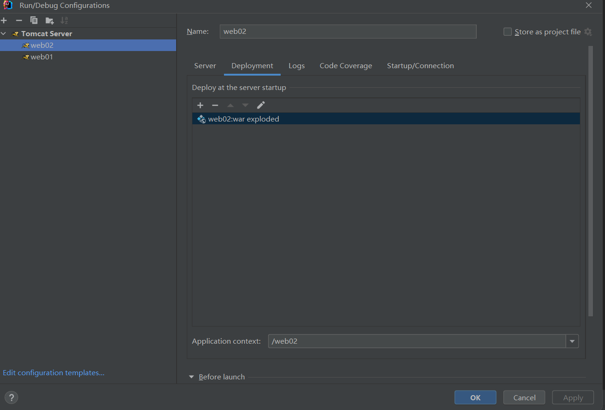

---

---

# 20221008

## 一、JavaWeb 概念

### 1、定义

所有使用浏览器访问的 Java 程序的总称。

> 基于成对出现的请求与响应。

### 2、分类

静态资源：html、css、js、mp4、jpg 等。

动态资源：Servlet 程序、jsp 页面。

### 3、常用的 WEB 服务器

Tomcat。

### 4、Tomcat 的使用

#### (1) 安装

解压如下压缩包即可。


#### (2) 目录介绍

- bin：专门存放可执行程序。
- conf：专门存放配置文件。
- lib：专门存放依赖的 jar 文件。
- logs：专门存放日志文件。
- temp：专门存放运行时的临时数据。
- webapps：专门存放部署的 web 工程。
- work：Tomcat 工作时目录。

#### (3) 服务的启动

##### a. 使用 .bat 文件

双击 `bin/startup.bat` 启动 Tomcat 服务器。

##### b. 使用命令行

命令行切换到 `bin` 目录下，输入 `catalina run`。

这种方式可以更详细地显示错误信息。

#### (4) 服务的终止

双击 `bin/shutdown.bat` 停止 Tomcat 服务器。

#### (5) 修改 Tomcat 默认端口号

在 `conf/server.xml` 中进行修改。

```xml
    <Connector port="8080" protocol="HTTP/1.1"
               connectionTimeout="20000"
               redirectPort="8443" />
```

#### (6) 将 Web 工程部署到 Tomcat 服务器的方法

##### a. 直接拷贝

将项目文件直接拷贝到 `webapps` 文件夹中 。

##### b. 配置文件方式

在 `conf/Catalina/localhost` 文件夹中新建 `.xml` 配置文件。

`.xml` 文件案例：

```xml
<!--
	Context 为工程上下文
	path：工程访问路径，即 localhost:8080path
	docBase：工程实际存放的地址

-->
<Context path="/book" docBase="Z:\book" />
```

> `.xml` 文件编码方式必须为 `UTF-8`。

#### (7) 使用浏览器直接打开 HTML 文件和使用 Tomcat 访问的区别

##### a. 直接打开

使用 `file://` 协议，告诉浏览器解析磁盘中的内容。

##### b. 使用 Tomcat 访问

使用 `http://` 协议，请求访问并解析服务器中的内容。


#### (8) 默认访问页面

输入 `http://ip:port` 将默认访问 `http://ip:port/root/index.html`。

##### (9) IDEA 整合 Tomcat

在 `Settings/Application Servers` 下进行服务器的配置。


# 20221009

## 一、IDEA JavaWeb

### 1、使用 IDEA 创建动态 Web 工程

第一步：新建模块


第二步：配置模块

左侧生成器选择 `Java Enterprise`，Template 选择 `Web Application`，选取对应的服务器。

### 2、目录结构

>生成项目目录的小技巧：
>
>​		在项目文件夹内，使用快捷键 `Shift + 右击` ，启动 Windows PowerShell 命令窗口。
>
>
>
>在命令行窗口输入 `tree /f >project.txt` 项目目录便存入了 project.txt 文本文件中。

├─java
│  └─com
│      └─zzy
│          └─servlet
│                  HelloServlet.java
│                  HelloServlet2.java
│                  HelloServlet3.java
│                  
├─resources
└─webapp
    │  a.html
    │  b.html
    │  index.jsp
    │  
    └─WEB-INF
            web.xml

`webapp` 专门存放 web 工程资源文件。

`WEB-INF` 是受服务器保护的目录，浏览器无法直接访问此目录的内容。

`web.xml` 是整个 web 工程的配置文件。

### 3、为 JavaWeb 工程添加依赖

#### (1) 选择“项目结构”


#### (2) 添加依赖


在 Artifacts 中检查部署选项。

### 4、将工程部署到 Tomcat 

#### (1) 编辑配置


#### (2) 部署配置



选择将什么部署到 Tomcat 中。

#### (3) 默认 url 设置


需要保证此 url 与上图 Application Content 保持一致。

> Application Content 就是工程路径。

#### (4) 实例的重启


### 5、相关配置更改

- 设置资源热部署


# 20221010

## 一、Servlet

### 1、什么是 Servlet

- Java EE 规范之一。规范即为接口。
- 是 JavaWeb 三大组件之一。另外两个为 Filter 过滤器和 Lisenter 监听器。
- 是服务器上的一个 Java 程序，可以接收客户端请求，并向客户端发送数据。

### 2、Servlet 手动实现

#### 实现方式一：实现 Servlet 接口

在 `src/main/java` 下创建一个类，实现 Servlet 接口。

```java
public class HelloServlet implements Servlet {
    @Override
    public void init(ServletConfig servletConfig) throws ServletException {

    }

    @Override
    public ServletConfig getServletConfig() {
        return null;
    }

    @Override
    public void service(ServletRequest servletRequest, ServletResponse servletResponse) throws ServletException, IOException {
        System.out.println("Hello Servlet");
    }

    @Override
    public String getServletInfo() {
        return null;
    }

    @Override
    public void destroy() {

    }
}
```

其中，`service()` 方法专门处理 Servlet 请求。

实现 Servlet 类后，还要配置使用怎样的 url 才能够使用这个类。

在 `src/main/webapp/WEB-INF/web.xml` 中进行配置。

```xml
    <servlet>
        <!--类的别名-->
        <servlet-name>HelloServlet</servlet-name>
        <!--全类名-->
        <servlet-class>com.servlet.HelloServlet</servlet-class>
    </servlet>
    
    <servlet-mapping>
        <!--类的别名-->
        <servlet-name>HelloServlet</servlet-name>
        <!--url配置-->
        <!--http://ip:port/工程路径/hello-->
        <url-pattern>/hello</url-pattern>
    </servlet-mapping>
```

> url 寻找资源的过程：
>
> 

### 3、Servlet 生命周期

Servlet 生命周期分为四步：

- 调用构造方法，创建实例

- `init()` 方法，进行初始化

  前两个过程只执行一次

- `service()` 处理请求
- `destroy()` 销毁

### 4、Servlet 请求的分发处理

> Http 请求分为 get 请求和 post 请求。

因此，如果想要对 Http 请求进行分发处理，首先要获取请求的类型。

```java
    public void service(ServletRequest servletRequest, ServletResponse servletResponse) throws ServletException, IOException {
        System.out.println("Hello Servlet");
    }
```

`ServletRequest` 接口中无法获取请求的类型，实现 `ServletRequest` 接口的 `HttpServletRequest` 接口中有获取请求类型的方法 `getMethod()`。

```java
String getMethod();
```

客户端发来的 Http 请求一定是 `HttpServletRequest` 接口的实现类，将 `servletRequest` 向下转型为 `HttpServletRequest` 接口类型，一定不会导致类型转换问题。

```java
    public void service(ServletRequest servletRequest, ServletResponse servletResponse) throws ServletException, IOException {
        // 类型转换
        HttpServletRequest httpServletRequest = (HttpServletRequest) servletRequest;

        // 请求分发
        if("GET".equals(httpServletRequest.getMethod())) {
            System.out.println("收到了get请求");
        } else {
            System.out.println("收到了 post 请求");
        }
    }
```

### 5、通过继承 `HttpServlet` 类实现 Servlet

`HttpServlet` 间接实现了 `Servlet`，并且更加明确程序是处理 HTTP 请求的。

#### (1) 继承 `HttpServlet` 

为了实现请求的分发处理，重写处理两种请求的方法。

```java
public class HelloServlet02 extends HttpServlet {
    @Override
    protected void doGet(HttpServletRequest req, HttpServletResponse resp) throws ServletException, IOException {
        System.out.println("收到了get方法");
    }

    @Override
    protected void doPost(HttpServletRequest req, HttpServletResponse resp) throws ServletException, IOException {
        System.out.println("收到了post方法");
    }
}
```

抽象类 `HttpServlet` 的 `doGet` 和 `doPost` 方法具有默认实现。

```java
// 具有默认实现的 doGet()    
protected void doGet(HttpServletRequest req, HttpServletResponse resp) throws ServletException, IOException {
        String protocol = req.getProtocol();
        String msg = lStrings.getString("http.method_get_not_supported");
        if (protocol.endsWith("1.1")) {
            resp.sendError(405, msg);
        } else {
            resp.sendError(400, msg);
        }

    }
```

```java
// 具有默认实现的 doPost()    
protected void doPost(HttpServletRequest req, HttpServletResponse resp) throws ServletException, IOException {
        String protocol = req.getProtocol();
        String msg = lStrings.getString("http.method_post_not_supported");
        if (protocol.endsWith("1.1")) {
            resp.sendError(405, msg);
        } else {
            resp.sendError(400, msg);
        }

    }
```

#### (2) 在 `web.xml` 中进行配置

### 6、使用 IDEA 工具生成 Servlet 程序

#### (1) 生成继承 `HttpServlet` 的类

并且，类中会重写 `doGet` 和 `doPost` 方法。

```java
public class HelloServlet03 extends HttpServlet {
    @Override
    protected void doGet(HttpServletRequest request, HttpServletResponse response) throws ServletException, IOException {
        
    }

    @Override
    protected void doPost(HttpServletRequest request, HttpServletResponse response) throws ServletException, IOException {

    }
}
```

#### (2) `web.xml` 中自动填充

会自动填入 `<servlet>` 标签，`<servlet-mapping>` 需要自己填写。

# 20221011

## 一、Servlet 继承谱系

### 1、继承关系与相关方法

- `servlet` 接口

  抽象方法 `service()`。

  ```java
  void service(ServletRequest var1, ServletResponse var2) throws ServletException, IOException;
  ```

  

  - `GenericServlet` 抽象类

    `service()` 方法仍然是抽象的。

    ```java
    public abstract void service(ServletRequest var1, ServletResponse var2) throws ServletException, IOException;
    ```

    

    - `HttpServlet` 抽象类

      对 `service()` 方法有了默认实现。将对请求进行分发，例如方法为 GET 时，会调用`doGet()`。

      而 `doGet()` 方法在类中也有基本的默认实现，具体的功能可以继承该类重写实现。

      ```java
      protected void service(HttpServletRequest req, HttpServletResponse resp) throws ServletException, IOException {
          	// 获取请求的方法
              String method = req.getMethod();
              long lastModified;
              if (method.equals("GET")) {
                  lastModified = this.getLastModified(req);
                  if (lastModified == -1L) {
                      this.doGet(req, resp);
                  } else {
                      long ifModifiedSince = req.getDateHeader("If-Modified-Since");
                      if (ifModifiedSince < lastModified) {
                          this.maybeSetLastModified(resp, lastModified);
                          this.doGet(req, resp);
                      } else {
                          resp.setStatus(304);
                      }
                  }
              } else if (method.equals("HEAD")) {
                  lastModified = this.getLastModified(req);
                  this.maybeSetLastModified(resp, lastModified);
                  this.doHead(req, resp);
              } else if (method.equals("POST")) {
                  this.doPost(req, resp);
              } else if (method.equals("PUT")) {
                  this.doPut(req, resp);
              } else if (method.equals("DELETE")) {
                  this.doDelete(req, resp);
              } else if (method.equals("OPTIONS")) {
                  this.doOptions(req, resp);
              } else if (method.equals("TRACE")) {
                  this.doTrace(req, resp);
              } else {
                  String errMsg = lStrings.getString("http.method_not_implemented");
                  Object[] errArgs = new Object[]{method};
                  errMsg = MessageFormat.format(errMsg, errArgs);
                  resp.sendError(501, errMsg);
              }
      
          }
      ```

      `doGet()` 默认实现方法：

      ```java
          protected void doGet(HttpServletRequest req, HttpServletResponse resp) throws ServletException, IOException {
              String protocol = req.getProtocol(); // 获取协议
              // 在 lStrings 中获取要输出的信息
              String msg = lStrings.getString("http.method_get_not_supported");
              if (protocol.endsWith("1.1")) {
                  resp.sendError(405, msg);
              } else {
                  resp.sendError(400, msg);
              }
      
          }
      ```

### 	2、Servlet 生命周期

Servlet 生命周期对应 Servlet 中的三个方法：`init()`、`service()` 和 `destroy()`。

第一次请求时，Tomcat 会实例化并初始化。

这会导致第一次请求时，等待时间过长。

#### (1) 在特定时间进行初始化

为了加快第一次请求的访问速度，可以将 Servlet 类实例化的时机改为 Tomcat 启动时。

在 `web.xml` 中添加 `<load-on-startup>` 标签来更早地初始化 Servlet 实例。

```xml
    <servlet>
        <servlet-name>HelloServlet02</servlet-name>
        <servlet-class>com.servlet.HelloServlet02</servlet-class>
        <load-on-startup>1</load-on-startup>
    </servlet>
```

标签 `<load-on-startup>` 最小值为 0。

这样，我还没有请求，Servlet 实例就创建好了。

```
Connected to server
[2022-10-11 08:07:55,122] Artifact web03:war exploded: Artifact is being deployed, please wait...
11-Oct-2022 20:07:55.301 警告 [RMI TCP Connection(2)-127.0.0.1] org.apache.tomcat.util.descriptor.web.WebXml.setVersion Unknown version string [4.0]. Default version will be used.
init方法...
```

> 想提高系统的启动速度，可以在请求时再实例化 Servlet 对象。
>
> 想提升每个用户的请求速度，可以将 Servlet 实例化过程提前。

#### (2) Servlet 在容器中的特性

Servlet 在容器中是单例的、线程不安全的。

> 线程不安全：Servlet 实例的成员变量没有加锁，导致线程间自由地使用成员变量。

启发：尽量不要在 Servlet 中定义成员变量，如果非要不可，那么不要让线程自由更改成员变量的值。

## 二、Http 协议

> 在浏览器开发者工具 (F12) 点击“ 网络”，即可查看各种 Http 请求。
>
> 

### 1、无状态

### 2、组成部分

Http 包含请求与响应。

#### (1) 请求

请求包含三部分：


- 请求行

  展示当前请求最基本的信息。

  - 请求方式
  - 访问地址
  - Http 协议版本

- 请求消息头

  包含客户端告知服务端的很多信息。

- 请求主体

  - get 方式：没有请求体，有 QueryString，跟在 url 后面。
  - post 方式：有请求体，Form Data。
  - json：有请求体，request payload。

#### (2) 响应


响应也包含三部分：

- 响应行

  此次响应的简要信息描述。

  - 协议
  - 响应状态码
    - 500：服务器内部错误
    - 200：正常响应
    - 404：找不到资源
    - 405：响应状态不支持
  - 响应状态短语
    - OK

- 响应头

  包含服务器的各种信息。

- 响应体

  响应的实际内容。
