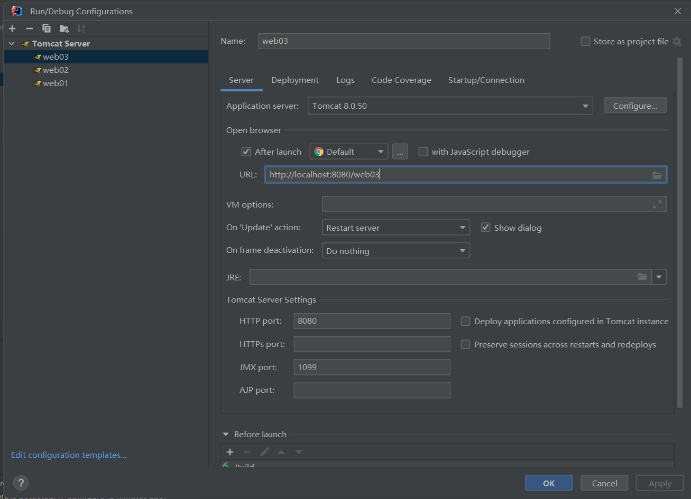
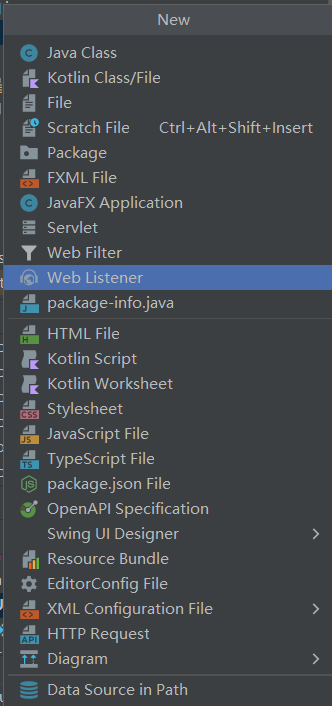

---

---

# 20221008

## 一、JavaWeb 概念

### 1、定义

所有使用浏览器访问的 Java 程序的总称。

> 基于成对出现的请求与响应。

### 2、分类

静态资源：html、css、js、mp4、jpg 等。

动态资源：Servlet 程序、jsp 页面。

### 3、常用的 WEB 服务器

Tomcat。

### 4、Tomcat 的使用

#### (1) 安装

解压如下压缩包即可。


#### (2) 目录介绍

- bin：专门存放可执行程序。
- conf：专门存放配置文件。
- lib：专门存放依赖的 jar 文件。
- logs：专门存放日志文件。
- temp：专门存放运行时的临时数据。
- webapps：专门存放部署的 web 工程。
- work：Tomcat 工作时目录。

#### (3) 服务的启动

##### a. 使用 .bat 文件

双击 `bin/startup.bat` 启动 Tomcat 服务器。

##### b. 使用命令行

命令行切换到 `bin` 目录下，输入 `catalina run`。

这种方式可以更详细地显示错误信息。

#### (4) 服务的终止

双击 `bin/shutdown.bat` 停止 Tomcat 服务器。

#### (5) 修改 Tomcat 默认端口号

在 `conf/server.xml` 中进行修改。

```xml
    <Connector port="8080" protocol="HTTP/1.1"
               connectionTimeout="20000"
               redirectPort="8443" />
```

#### (6) 将 Web 工程部署到 Tomcat 服务器的方法

##### a. 直接拷贝

将项目文件直接拷贝到 `webapps` 文件夹中 。

##### b. 配置文件方式

在 `conf/Catalina/localhost` 文件夹中新建 `.xml` 配置文件。

`.xml` 文件案例：

```xml
<!--
	Context 为工程上下文
	path：工程访问路径，即 localhost:8080path
	docBase：工程实际存放的地址

-->
<Context path="/book" docBase="Z:\book" />
```

> `.xml` 文件编码方式必须为 `UTF-8`。

#### (7) 使用浏览器直接打开 HTML 文件和使用 Tomcat 访问的区别

##### a. 直接打开

使用 `file://` 协议，告诉浏览器解析磁盘中的内容。

##### b. 使用 Tomcat 访问

使用 `http://` 协议，请求访问并解析服务器中的内容。


#### (8) 默认访问页面

输入 `http://ip:port` 将默认访问 `http://ip:port/root/index.html`。

##### (9) IDEA 整合 Tomcat

在 `Settings/Application Servers` 下进行服务器的配置。


# 20221009

## 一、IDEA JavaWeb

### 1、使用 IDEA 创建动态 Web 工程

第一步：新建模块


第二步：配置模块

左侧生成器选择 `Java Enterprise`，Template 选择 `Web Application`，选取对应的服务器。

### 2、目录结构

>生成项目目录的小技巧：
>
>​		在项目文件夹内，使用快捷键 `Shift + 右击` ，启动 Windows PowerShell 命令窗口。
>
>
>
>在命令行窗口输入 `tree /f >project.txt` 项目目录便存入了 project.txt 文本文件中。

├─java
│  └─com
│      └─zzy
│          └─servlet
│                  HelloServlet.java
│                  HelloServlet2.java
│                  HelloServlet3.java
│                  
├─resources
└─webapp
    │  a.html
    │  b.html
    │  index.jsp
    │  
    └─WEB-INF
            web.xml

`webapp` 专门存放 web 工程资源文件。

`WEB-INF` 是受服务器保护的目录，浏览器无法直接访问此目录的内容。

`web.xml` 是整个 web 工程的配置文件。

### 3、为 JavaWeb 工程添加依赖

#### (1) 选择“项目结构”


#### (2) 添加依赖


在 Artifacts 中检查部署选项。

### 4、将工程部署到 Tomcat 

#### (1) 编辑配置


#### (2) 部署配置


选择将什么部署到 Tomcat 中。

#### (3) 默认 url 设置



需要保证此 url 与上图 Application Content 保持一致。

> Application Content 就是工程路径。

#### (4) 实例的重启


### 5、相关配置更改

- 设置资源热部署


# 20221010

## 一、Servlet

### 1、什么是 Servlet

- Java EE 规范之一。规范即为接口。
- 是 JavaWeb 三大组件之一。另外两个为 Filter 过滤器和 Lisenter 监听器。
- 是服务器上的一个 Java 程序，可以接收客户端请求，并向客户端发送数据。

### 2、Servlet 手动实现

#### 实现方式一：实现 Servlet 接口

在 `src/main/java` 下创建一个类，实现 Servlet 接口。

```java
public class HelloServlet implements Servlet {
    @Override
    public void init(ServletConfig servletConfig) throws ServletException {

    }

    @Override
    public ServletConfig getServletConfig() {
        return null;
    }

    @Override
    public void service(ServletRequest servletRequest, ServletResponse servletResponse) throws ServletException, IOException {
        System.out.println("Hello Servlet");
    }

    @Override
    public String getServletInfo() {
        return null;
    }

    @Override
    public void destroy() {

    }
}
```

其中，`service()` 方法专门处理 Servlet 请求。

实现 Servlet 类后，还要配置使用怎样的 url 才能够使用这个类。

在 `src/main/webapp/WEB-INF/web.xml` 中进行配置。

```xml
    <servlet>
        <!--类的别名-->
        <servlet-name>HelloServlet</servlet-name>
        <!--全类名-->
        <servlet-class>com.servlet.HelloServlet</servlet-class>
    </servlet>
    
    <servlet-mapping>
        <!--类的别名-->
        <servlet-name>HelloServlet</servlet-name>
        <!--url配置-->
        <!--http://ip:port/工程路径/hello-->
        <url-pattern>/hello</url-pattern>
    </servlet-mapping>
```

> url 寻找资源的过程：
>
> 

### 3、Servlet 生命周期

Servlet 生命周期分为四步：

- 调用构造方法，创建实例

- `init()` 方法，进行初始化

  前两个过程只执行一次

- `service()` 处理请求
- `destroy()` 销毁

### 4、Servlet 请求的分发处理

> Http 请求分为 get 请求和 post 请求。

因此，如果想要对 Http 请求进行分发处理，首先要获取请求的类型。

```java
    public void service(ServletRequest servletRequest, ServletResponse servletResponse) throws ServletException, IOException {
        System.out.println("Hello Servlet");
    }
```

`ServletRequest` 接口中无法获取请求的类型，实现 `ServletRequest` 接口的 `HttpServletRequest` 接口中有获取请求类型的方法 `getMethod()`。

```java
String getMethod();
```

客户端发来的 Http 请求一定是 `HttpServletRequest` 接口的实现类，将 `servletRequest` 向下转型为 `HttpServletRequest` 接口类型，一定不会导致类型转换问题。

```java
    public void service(ServletRequest servletRequest, ServletResponse servletResponse) throws ServletException, IOException {
        // 类型转换
        HttpServletRequest httpServletRequest = (HttpServletRequest) servletRequest;

        // 请求分发
        if("GET".equals(httpServletRequest.getMethod())) {
            System.out.println("收到了get请求");
        } else {
            System.out.println("收到了 post 请求");
        }
    }
```

### 5、通过继承 `HttpServlet` 类实现 Servlet

`HttpServlet` 间接实现了 `Servlet`，并且更加明确程序是处理 HTTP 请求的。

#### (1) 继承 `HttpServlet` 

为了实现请求的分发处理，重写处理两种请求的方法。

```java
public class HelloServlet02 extends HttpServlet {
    @Override
    protected void doGet(HttpServletRequest req, HttpServletResponse resp) throws ServletException, IOException {
        System.out.println("收到了get方法");
    }

    @Override
    protected void doPost(HttpServletRequest req, HttpServletResponse resp) throws ServletException, IOException {
        System.out.println("收到了post方法");
    }
}
```

抽象类 `HttpServlet` 的 `doGet` 和 `doPost` 方法具有默认实现。

```java
// 具有默认实现的 doGet()    
protected void doGet(HttpServletRequest req, HttpServletResponse resp) throws ServletException, IOException {
        String protocol = req.getProtocol();
        String msg = lStrings.getString("http.method_get_not_supported");
        if (protocol.endsWith("1.1")) {
            resp.sendError(405, msg);
        } else {
            resp.sendError(400, msg);
        }

    }
```

```java
// 具有默认实现的 doPost()    
protected void doPost(HttpServletRequest req, HttpServletResponse resp) throws ServletException, IOException {
        String protocol = req.getProtocol();
        String msg = lStrings.getString("http.method_post_not_supported");
        if (protocol.endsWith("1.1")) {
            resp.sendError(405, msg);
        } else {
            resp.sendError(400, msg);
        }

    }
```

#### (2) 在 `web.xml` 中进行配置

### 6、使用 IDEA 工具生成 Servlet 程序

#### (1) 生成继承 `HttpServlet` 的类

并且，类中会重写 `doGet` 和 `doPost` 方法。

```java
public class HelloServlet03 extends HttpServlet {
    @Override
    protected void doGet(HttpServletRequest request, HttpServletResponse response) throws ServletException, IOException {
        
    }

    @Override
    protected void doPost(HttpServletRequest request, HttpServletResponse response) throws ServletException, IOException {

    }
}
```

#### (2) `web.xml` 中自动填充

会自动填入 `<servlet>` 标签，`<servlet-mapping>` 需要自己填写。

# 20221011

## 一、Servlet 继承谱系

### 1、继承关系与相关方法

- `servlet` 接口

  抽象方法 `service()`。

  ```java
  void service(ServletRequest var1, ServletResponse var2) throws ServletException, IOException;
  ```

  

  - `GenericServlet` 抽象类

    `service()` 方法仍然是抽象的。

    ```java
    public abstract void service(ServletRequest var1, ServletResponse var2) throws ServletException, IOException;
    ```

    

    - `HttpServlet` 抽象类

      对 `service()` 方法有了默认实现。将对请求进行分发，例如方法为 GET 时，会调用`doGet()`。

      而 `doGet()` 方法在类中也有基本的默认实现，具体的功能可以继承该类重写实现。

      ```java
      protected void service(HttpServletRequest req, HttpServletResponse resp) throws ServletException, IOException {
          	// 获取请求的方法
              String method = req.getMethod();
              long lastModified;
              if (method.equals("GET")) {
                  lastModified = this.getLastModified(req);
                  if (lastModified == -1L) {
                      this.doGet(req, resp);
                  } else {
                      long ifModifiedSince = req.getDateHeader("If-Modified-Since");
                      if (ifModifiedSince < lastModified) {
                          this.maybeSetLastModified(resp, lastModified);
                          this.doGet(req, resp);
                      } else {
                          resp.setStatus(304);
                      }
                  }
              } else if (method.equals("HEAD")) {
                  lastModified = this.getLastModified(req);
                  this.maybeSetLastModified(resp, lastModified);
                  this.doHead(req, resp);
              } else if (method.equals("POST")) {
                  this.doPost(req, resp);
              } else if (method.equals("PUT")) {
                  this.doPut(req, resp);
              } else if (method.equals("DELETE")) {
                  this.doDelete(req, resp);
              } else if (method.equals("OPTIONS")) {
                  this.doOptions(req, resp);
              } else if (method.equals("TRACE")) {
                  this.doTrace(req, resp);
              } else {
                  String errMsg = lStrings.getString("http.method_not_implemented");
                  Object[] errArgs = new Object[]{method};
                  errMsg = MessageFormat.format(errMsg, errArgs);
                  resp.sendError(501, errMsg);
              }
      
          }
      ```

      `doGet()` 默认实现方法：

      ```java
          protected void doGet(HttpServletRequest req, HttpServletResponse resp) throws ServletException, IOException {
              String protocol = req.getProtocol(); // 获取协议
              // 在 lStrings 中获取要输出的信息
              String msg = lStrings.getString("http.method_get_not_supported");
              if (protocol.endsWith("1.1")) {
                  resp.sendError(405, msg);
              } else {
                  resp.sendError(400, msg);
              }
      
          }
      ```

### 	2、Servlet 生命周期

Servlet 生命周期对应 Servlet 中的三个方法：`init()`、`service()` 和 `destroy()`。

第一次请求时，Tomcat 会实例化并初始化。

这会导致第一次请求时，等待时间过长。

#### (1) 在特定时间进行初始化

为了加快第一次请求的访问速度，可以将 Servlet 类实例化的时机改为 Tomcat 启动时。

在 `web.xml` 中添加 `<load-on-startup>` 标签来更早地初始化 Servlet 实例。

```xml
    <servlet>
        <servlet-name>HelloServlet02</servlet-name>
        <servlet-class>com.servlet.HelloServlet02</servlet-class>
        <load-on-startup>1</load-on-startup>
    </servlet>
```

标签 `<load-on-startup>` 最小值为 0。

这样，我还没有请求，Servlet 实例就创建好了。

```
Connected to server
[2022-10-11 08:07:55,122] Artifact web03:war exploded: Artifact is being deployed, please wait...
11-Oct-2022 20:07:55.301 警告 [RMI TCP Connection(2)-127.0.0.1] org.apache.tomcat.util.descriptor.web.WebXml.setVersion Unknown version string [4.0]. Default version will be used.
init方法...
```

> 想提高系统的启动速度，可以在请求时再实例化 Servlet 对象。
>
> 想提升每个用户的请求速度，可以将 Servlet 实例化过程提前。

#### (2) Servlet 在容器中的特性

Servlet 在容器中是单例的、线程不安全的。

> 线程不安全：Servlet 实例的成员变量没有加锁，导致线程间自由地使用成员变量。

启发：尽量不要在 Servlet 中定义成员变量，如果非要不可，那么不要让线程自由更改成员变量的值。

## 二、Http 协议

> 在浏览器开发者工具 (F12) 点击“ 网络”，即可查看各种 Http 请求。
>
> 

### 1、无状态

### 2、组成部分

Http 包含请求与响应。

#### (1) 请求

请求包含三部分：


- 请求行

  展示当前请求最基本的信息。

  - 请求方式
  - 访问地址
  - Http 协议版本

- 请求消息头

  包含客户端告知服务端的很多信息。

- 请求主体

  - get 方式：没有请求体，有 QueryString，跟在 url 后面。
  - post 方式：有请求体，Form Data。
  - json：有请求体，request payload。

#### (2) 响应


响应也包含三部分：

- 响应行

  此次响应的简要信息描述。

  - 协议
  - 响应状态码
    - 500：服务器内部错误
    - 200 OK：正常响应
    - 302 Found：重定向
    - 404：找不到资源
    - 405：响应状态不支持
  - 响应状态短语
    - OK

- 响应头

  包含服务器的各种信息。

- 响应体

  响应的实际内容。

# 20221013

## 一、会话

### 1、HTTP 的无状态

>HTTP 无法区分请求主体。
>
>无状态带来的问题：无法执行多次 HTTP 请求才能完成的动作。

可以通过会话跟踪技术解决 HTTP 无状态问题。

### 2、Session 会话技术原理

当客户端第一次对服务器发起请求时，服务器会给客户端发送 SessionId。当下一次客户端请求服务器时，带上这个 SessionId 便可以实现 Http 的有状态。

使用案例：

```java
public class HelloServlet03 extends HttpServlet {
    @Override
    protected void service(HttpServletRequest req, HttpServletResponse resp) throws ServletException, IOException {
        // 获取 Session
        HttpSession session = req.getSession();

        // 打印 Session ID
        System.out.println("Session ID: " + session.getId());
    }
}
```

### 3、会话中常用的 API

```java
// 获取会话
HttpSession session = HttpServletRequest实例.getSession();
// 获取会话，没有会话不会创建新会话
HttpSession session = HttpServletRequest实例.getSession(false);
// 获取会话Id
session.getId(); 
// 判断当前 Session 是否为新的
session.isNew();
// 获取 Session 有效时间/最大无激活时间，默认1800秒
session.getMaxInactiveInterval();
// 设置 Session 有效时间，单位：秒
session.setMaxInactiveInterval();
// 让会话立即失效
session.invalidate();
// 获取 Session 创建时间
session.getCreationTime();
```

### 4、Session 保存作用域

#### (1) 定义

会话中可以保存数据。Session 保存作用域是和某个具体的会话对应的。

#### (2) 常用 API

```java
// 设置属性
void session.setAtrribute(k, v);
// 获取属性
Object session.getAttribute(k)
// 移除属性
void session.removeAttribute(k)
```

使用案例：

`HelloServlet03` 可以设置 Session 的属性。

`HelloServlet04` 可以获取 Session 的属性。

依次访问 `HelloServlet03` 和 `HelloServlet04`，如果是同一客户端进行访问，`HelloServlet04` 便可以访问到 Session 的属性。若一个客户端访问了 `HelloServlet03`，另一个客户端访问了 `HelloServlet04`，便无法访问到 Session 属性，这就达成了用户的区分与隔离。

```java
public class HelloServlet03 extends HttpServlet {
    @Override
    protected void service(HttpServletRequest req, HttpServletResponse resp) throws ServletException, IOException {
        // 获取 Session
        HttpSession session = req.getSession();

        // 设置 Session 属性
        session.setAttribute("sName", "lina");
    }
}
```

```java
public class HelloServlet04 extends HttpServlet {
    @Override
    protected void service(HttpServletRequest req, HttpServletResponse resp) throws ServletException, IOException {
        // 获取 Session
        HttpSession session = req.getSession();

        // 获取属性
        Object sName = session.getAttribute("sName");

        System.out.println(sName);
    }
}
```

## 二、服务端转发和客户端重定向

若服务器的一个组件接收到请求后，需要其他组件对该请求进行处理，可以使用服务器转发和客户端重定向两种方式将请求发至其他组件。

#### 1、服务器内部转发

只有一次请求与响应，请求在客户端内部转发了多少次客户端不知道。最显著的特征是浏览器地址栏没有变化。

请求转发方式可以访问到 `WEB-INF` 内的文件。

原理图：


服务器内部转发用到的 API：

```java
// 获取 RequestDispatcher
请求实例.getRequestDispatcher(地址);
// 转发请求与响应
RequestDispatcher实例.forword(请求实例, 响应实例);
```

使用案例：

`HelloServlet03` 中会将请求与响应转发至 `HelloServlet04`。

```java
public class HelloServlet03 extends HttpServlet {
    @Override
    protected void service(HttpServletRequest req, HttpServletResponse resp) throws ServletException, IOException {
        // 服务器端内部转发
        req.getRequestDispatcher("hello04").forward(req, resp);
    }
}
```


#### 2、客户端重定向

每多一次重定向会多一次请求与响应。最显著的特征是浏览器地址栏变化。


使用到的 API：

```java
// 在响应中包含重定向地址，因此是响应实例调用
响应.sendRedirect(地址);
```

使用案例：

`HelloServlet03` 响应中包含重定向信息。

```java
public class HelloServlet03 extends HttpServlet {
    @Override
    protected void service(HttpServletRequest req, HttpServletResponse resp) throws ServletException, IOException {
        System.out.println("hello03...");
        // 进行重定向
        resp.sendRedirect("hello04");
    }
}
```

`HelloServlet04` 将对请求进行处理。

```java
public class HelloServlet04 extends HttpServlet {
    @Override
    protected void service(HttpServletRequest req, HttpServletResponse resp) throws ServletException, IOException {
        System.out.println("hello04收到请求，进行处理");
    }
}
```

## 三、ServletConfig 类

Servlet 配置信息类，ServletConfig 实例也是在 Servlet 实例创建时创建，其中封装了初始化配置信息。

### 1、三大作用

- 获取 Servlet 程序的别名 servlet-name

  使用方法：

  ```java
  类的别名 = ServletConfig实例.getServletName()
  ```

  使用案例：

  ```java
      public void init(ServletConfig servletConfig) throws ServletException {
          System.out.println(servletConfig.getServletName());
      }
  ```

- 获取初始化参数 init-param

  可以在 `web.xml` 中的 servlet 标签中进行添加。

  例如：

  ```xml
      <servlet>
          <!--类的别名-->
          <servlet-name>HelloServlet</servlet-name>
          <!--全类名-->
          <servlet-class>com.servlet.HelloServlet</servlet-class>
          
          <init-param>
              <param-name>serverNo</param-name>
              <param-value>110</param-value>
          </init-param>
      </servlet>
  ```

  使用方法：

  ```java
  String getInitParm(String name)
  ```

  使用案例：

  ```java
  System.out.println("获取到的init-param参数：" + servletConfig.getInitParameter("serverNo"));
  ```

- 获取 ServletContext 对象

  使用 API：

  ```java
  ServletContext getservletContext();
  servletContext实例 = ServletConfig实例.getservletContext()
  ```
  

# 20221014

## 一、ServletContext 类

- Servlet 上下文。

- 一个 web 工程，只有一个 ServletContext 对象。

- ServletContext 对象是一个域对象。

  - 像 Map 一样放入数据、取数据和删除数据。

    `setAttribute()`、`getAttribute` 和 `removeAttribute()`。

  - 这里的域指的是存取数据的操作范围：整个 web 工程。

- 在 web 工程部署时创建，在 web 工程结束时销毁。

创建 `ServletContext ` 对象可以使用这种方式：

```java
ServletContext servletContext = this.getServletConfig().getServletContext();
```

也可以使用更简单的方式：

```java
this.getServletContext()
```

这是因为在 `GenericServlet` 中：

```java
public ServletContext getServletContext() {
    ServletConfig sc = this.getServletConfig(); // 自动调用getServletConfig()方法
    if (sc == null) {
        throw new IllegalStateException(lStrings.getString("err.servlet_config_not_initialized"));
    } else {
        return sc.getServletContext();
    }
}
```

### 1、作用

#### (1) 获取 `web.xml` 中配置的上下文参数 `context-param`

在 `web.xml` 中进行配置：

```xml
    <!--上下文参数-->
    <context-param>
        <param-name>username</param-name>
        <param-value>context</param-value>
    </context-param>
```

上下文参数是整个 web 工程的，因此是独立的标签。

使用 ServletConfig 实例获取 ServletContext 实例。

```java
public class ContextServlet extends HttpServlet {
    @Override
    protected void doGet(HttpServletRequest request, HttpServletResponse response) throws ServletException, IOException {
        // 获取上下文对象
        ServletContext servletContext = this.getServletConfig().getServletContext();

        // 输出上下文参数
        System.out.println(servletContext.getInitParameter("username"));
    }

    @Override
    protected void doPost(HttpServletRequest request, HttpServletResponse response) throws ServletException, IOException {
    }
}
```

#### (2) 获取当前工程路径

使用到的 API：

```java
servletContext.getContextPath() -> String
```

使用案例：

```java
// 获取当前工程路径
System.out.println("当前工程路径为：" + servletContext.getContextPath());
```

执行结果：

```java
当前工程路径为：/web03
```

#### (3) 获取工程部署在硬盘上的绝对路径

使用到的 API：

```java
// path 是浏览器访问的虚拟地址
servletContext.getRealPath(String path) -> String
```

使用案例：

```java
// 获取当前工程在服务器硬盘地址
// 斜杠 / 会被服务器解析为 http://ip:port/工程路径
// 以下代码会返回整个工程在服务器上的硬盘地址
System.out.println("当前工程在服务器硬盘上的地址为：" + servletContext.getRealPath("/"));
```

以上代码执行结果为：

```
当前工程在服务器硬盘上的地址为：Z:\postgraduate_learning\JavaWeb\web03\target\web03-1.0-SNAPSHOT\
```

#### (4) 像 Map 一样存取数据

在某个 Serlvet 程序中可以设置键值对，一旦设置，其他 Servlet 程序也可以访问键值对。

使用案例：

在 `ContextServlet` 类中设置键值对

```java
protected void doGet(HttpServletRequest request, HttpServletResponse response) throws ServletException, IOException {
    // 获取 ServletContext 对象
    ServletContext servletContext = getServletContext();

    // 设置键值对
    servletContext.setAttribute("username", "mary");

}
```

设置完成后， `HelloServlet03` 对象也可以访问。

```java
protected void service(HttpServletRequest req, HttpServletResponse resp) throws ServletException, IOException {
    // 获取 Servlet 上下文对象
    ServletContext servletContext = getServletContext();

    // 获取键值对
    Object username = servletContext.getAttribute("username");
    System.out.println(username);
}
```

## 二、MIME 数据类型

MIME 是 HTTP 中的数据类型。格式：大类型/小类型。


## 三、HTTPServletRequest 类

### 1、作用

每次有请求进入 Tomcat 服务器，Tomcat 服务器都会将请求的所有信息封装到 Request 中，然后传递到 `doGet()` 和 `doPost()` 方法中，供我们使用。

### 2、常用 API

```java
// 获取请求的资源路径
HTTPServletRequest实例.getRequestURI() -> String
// 获取请求 url
HTTPServletRequest实例.getRequestURL() -> StringBuffer
// 获取客户端 ip 地址    
HTTPServletRequest实例.getRemoteHost()
// 获取请求头
HTTPServletRequest实例.getHeader(String) -> String;
// 获取请求参数
// 这里的请求参数就是表单中提交的参数
HTTPServletRequest实例.getParameter(String) -> String;
// 获取多个请求参数
request.getParameterValues(String) -> String[];
// 获取请求方式
request.getMethod() -> String;
// 设置域数据
request.setAttribute(String, Object) -> void;
// 获取域数据
request.getAttribute(String) -> Object;
// 获取请求转发对象
request.getRequestDispatcher(String) -> RequestDispatcher
```

### 3、请求参数的获取

小案例：在 `a.html` 中画一个表单，使用 `HelloServlet03` 类获取提交的参数。

`a.html`：

```html
<form action="http://localhost:8080/web03/hello03" method="post">
    用户名<input type="text" name="username"><br>
    密码<input type="password" name="password" ><br>
    兴趣爱好<input type="checkbox" name="hobby" value="fwc">俯卧撑
    <input type="checkbox" name="hobby" value="yt">引体向上
    <input type="checkbox" name="hobby" value="yl">哑铃
    <br>
    <input type="submit" value="提交">
</form>
```

`HelloServlet03`：

```java
public class HelloServlet03 extends HttpServlet {
    @Override
    protected void doPost(HttpServletRequest req, HttpServletResponse resp) throws ServletException, IOException {
        String username = req.getParameter("username");
        String password = req.getParameter("password");
        String[] hobbies = req.getParameterValues("hobby");

        System.out.println("用户名: " + username);
        System.out.println("密码：" + password);
        for (String hobby : hobbies) {
            System.out.println(hobby);
        }
    }
}
```

Post 方式会出现的 bug：输入框内填入中文，控制台获取到无法输出。

可以设置一下请求的字符集：

```java
req.setCharacterEncoding("UTF-8");
```

## 四、Base 标签

base 标签是 HTML 的一个标签。

如果跳转到了某个页面，使用相对路径进行跳转时，不会将地址栏中的地址作为当前页面的地址，而是将使用 base 标签中的地址作为当前页面的地址。

使用案例：

`HelloServlet03`：

```java
public class HelloServlet03 extends HttpServlet {
    @Override
    protected void doGet(HttpServletRequest req, HttpServletResponse resp) throws ServletException, IOException {
        // 请求转发
        req.getRequestDispatcher("/a/b/Hello.html").forward(req, resp);
    }
}
```

`a/b/Hello.html`：

```html
<!DOCTYPE html>
<html lang="en">
<head>
    <meta charset="UTF-8">
    <title>Hello</title>
    <!--进行相对路径跳转时参照的地址-->
    <!--浏览器会将 / 解析为 http://ip:port/-->
    <base href="/web03/a/b/Hello.html">
</head>

<body>
    <p>你好</p>
    <a href="../../a.html">返回首页</a>
</body>
</html>
```

请求转发发生后，地址栏为：

```
http://ip:port/工程路径/HelloServlet03路径
```

使用 `a/b/Hello.html` 中的相对路径跳转一定会导致地址无效，因此 `a/b/Hello.html` 需要设置 base 标签规定相对路径跳转时的参考位置。

## 五、Web 中的绝对路径和相对路径

### 1、绝对路径与相对路径

相对路径：

- . 当前目录
- .. 上一级目录
- 资源名 当前目录资源名

绝对路径：

http://ip:port/工程路径/资源路径

### 2、/ 的含义

/ 是绝对路径。

/ 被浏览器解析为：localhost:8080

例如：

```html
<a href="/">斜杠</a>
```

/ 被服务器解析为：http://ip:port/工程路径。

例如：

```xml
<servlet-mapping>
	<servlet-name>HelloServlet02</servlet-name>
	<url-pattern>/hello02</url-pattern>
</servlet-mapping>
```

```java
// 获取绝对路径
servletContext.getRealPath("/");
// 获取请求分发器
request.getRequestDispatcher("/")
```

特殊情况：

```java
response.sendRedirect("/")
```

上面的代码进行重定向，会将 / 发给客户端，客户端浏览器解析 / 为 `localhost:8080`。

# 20221015

## 一、`HttpServletResponse` 类

### 1、作用

和 `HttpServletRequest` 类一样，每次服务器得到请求，都会将响应信息封装到 `HttpServletResponse` 类中。

### 2、两个输出流

- 字节流

  使用的 API：

  ```java
  ServletOutputStream outputStream = response.getOutputStream();
  ```

  传递二进制数据。下载。

- 字符流

  使用的 API：

  ```java
  PrintWriter writer = response.getWriter();
  ```

  回传字符串。常用。

只能使用其中的一个。

### 3、如何给客户端回传数据

使用案例： `Servlet05` 程序可以给浏览器回传字符串。

```java
    protected void doGet(HttpServletRequest request, HttpServletResponse response) throws ServletException, IOException {
        // 获取字符输出流
        PrintWriter writer = response.getWriter();

        // 输出
        writer.write("你好，您的请求我已经收到！");
    }
```

> 会出现的 bug：中文乱码。
>
> 出现原因：`response` 默认字符集为 ISO-8859-1，此字符集不支持中文。
>
> 解决措施：
>
> ​	1、设置本次响应的编码方式为 UTF-8 
>
> ​	2、告知浏览器以 UTF-8 方式解码

```java
// 设置响应使用的字符集
response.setCharacterEncoding("UTF-8");

// 通过响应头，告知浏览器使用 UTF-8 进行解码
response.setHeader("Content-Type", "text/html; charset=UTF-8");
```

通过以上代码，可以得到如下的响应：

```
HTTP/1.1 200 OK
Server: Apache-Coyote/1.1
Content-Type: text/html;charset=UTF-8
Content-Length: 39
Date: Sat, 15 Oct 2022 09:07:29 GMT
```

> 解决措施二：同时设置服务器响应和客户端的字符集。
>
> 获取流之前使用。

```
// 服务器响应和客户端都使用 UTF-8 字符集
response.setContentType("text/html; charset=UTF-8");
```

### 4、请求重定向

原理图：


使用到的 API：

```java
response.sendRedirect(String path);
```

>参数中的 path 将交由服务器进行解析，传入 / 时会解析为 http://localhost:8080。

使用案例：`ResponseServlet1` 请求重定向至 `ResponseServlet2`。

解决方案1：直接使用上面的 API。

```java
public class ResponseServlet1 extends HttpServlet {
    @Override
    protected void doGet(HttpServletRequest request, HttpServletResponse response) throws ServletException, IOException {
        // 进行重定向
        response.sendRedirect("/web04/r2");
    }

    @Override
    protected void doPost(HttpServletRequest request, HttpServletResponse response) throws ServletException, IOException {
    }
}
```

```java
public class ResponseServlet2 extends HttpServlet {
    @Override
    protected void doGet(HttpServletRequest request, HttpServletResponse response) throws ServletException, IOException {
        System.out.println("收到请求，正在处理");
    }

    @Override
    protected void doPost(HttpServletRequest request, HttpServletResponse response) throws ServletException, IOException {

    }
}
```

解决方案2：`ResponseServlet1` 收到请求后，修改响应状态码，并设置响应头中的 Location 属性，帮助客户端进行重定向。

```java
protected void doGet(HttpServletRequest request, HttpServletResponse response) throws ServletException, IOException {
        // 设置响应头状态码
        response.setStatus(302);

        // 设置响应头中 Location 属性
        response.setHeader("Location", "/web04/r2");
    }
```

特点：

- 使用请求重定向无法访问 `WEB-INF` 中的资源。

- 可以访问工程以外的资源。

## 二、书城项目第二阶段

实现用户注册与登录。

### 1、JavaEE 项目三层架构


- web层/视图展现层
- service 业务层
- Dao 持久层
  - Database Access Object

项目的包结构：


### 2、代码编写流程

#### (1) 创建所需数据库和表

根据用户登录逻辑，使用到的表为 t_user。

t_user

- id 自增主键
- username not null unique
- password not null
- email 

#### (2) 编写数据库表对应的 JavaBean 对象

每一个数据库表都有一个类与之对应，放入 pojo 包中。

#### (3) 编写 Dao 持久层

需要编写工具类：JdbcUtils。

```java
public class DruidUtils {
    // 数据库连接池
    private static DataSource dataSource;

    // 类加载时创建数据库连接池
    static {
        // 获取配置文件中的信息
        Properties properties = new Properties();
        try {
            properties.load(new FileInputStream("src/main/resources/jdbc.properties"));

            // 创建连接池
            dataSource = DruidDataSourceFactory.createDataSource(properties);
        } catch (Exception e) {
            throw new RuntimeException(e);
        }
    }

    /**
     * 获取连接
     * @return 数据库连接池中的一个连接
     */
    public static Connection getConnection() throws SQLException {
        return dataSource.getConnection();
    }

    /**
     * 归还连接
     * @param resultSet 查询结果集
     * @param statement 数据库操作对象
     * @param connection 数据库连接
     */
    public static void close(ResultSet resultSet, Statement statement, Connection connection) {
        if (resultSet != null) {
            try {
                resultSet.close();
            } catch (SQLException e) {
                throw new RuntimeException(e);
            }
        }

        if (statement != null) {
            try {
                statement.close();
            } catch (SQLException e) {
                throw new RuntimeException(e);
            }
        }

        if (connection != null) {
            try {
                connection.close();
            } catch (SQLException e) {
                throw new RuntimeException(e);
            }
        }
    }
}
```

#### (4) 编写 BaseDao

```java
public abstract class BasicDao<T> {
    // 查询执行器对象
    private final QueryRunner runner = new QueryRunner();

    /**
     * 执行更新操作
     *
     * @param sql        执行的sql语句
     * @param parameters 替换参数
     * @return 受影响的行数
     */
    public int update(String sql, Object...parameters) {
        int effectedRows; // 受影响行数
        Connection connection = null;

        try {
            // 获取连接
            connection = DruidUtils.getConnection();

            // 执行查询
            effectedRows = runner.update(connection, sql, parameters);
        } catch (SQLException e) {
            throw new RuntimeException(e);
        } finally {
            // 关闭连接
            DruidUtils.close(null, null, connection);
        }

        // 返回结果
        return effectedRows;
    }

    /**
     * 查询多行结果
     * @param sql sql语句
     * @param clazz 需要的JavaBean的Class对象
     * @param parameters 替换参数
     * @return 查询结果集
     */
    public List<T> queryMulti(String sql, Class<T> clazz, Object...parameters) {
        List<T> list; // 查询结果集
        Connection connection = null;

        try {
            // 获取连接
            connection = DruidUtils.getConnection();

            // 执行查询
            list = runner.query(sql, new BeanListHandler<>(clazz), parameters);
        } catch (SQLException e) {
            throw new RuntimeException(e);
        } finally {
            // 关闭连接
            DruidUtils.close(null, null, connection);
        }

        // 返回结果
        return list;
    }

    /**
     * 查询单个结果
     * @param sql 需要执行的sql查询语句
     * @param clazz JavaBean的Class对象
     * @param parameters 替换参数
     * @return 查询结果
     */
    public T querySingle(String sql, Class<T> clazz, Object...parameters) {
        T t; // 返回的 JavaBean 对象

        Connection connection = null;

        try {
            // 获取连接
            connection = DruidUtils.getConnection();

            // 执行查询
            t = runner.query(sql, new BeanHandler<>(clazz), parameters);
        } catch (SQLException e) {
            throw new RuntimeException(e);
        } finally {
            // 关闭连接
            DruidUtils.close(null, null, connection);
        }

        // 返回结果
        return t;
    }

    /**
     * 查询标量
     * @param sql 查询sql语句
     * @param parameters 替换参数
     * @return 查询变量值
     */
    public Object queryScalar(String sql, Object...parameters) {
        Object o; // 返回的标量

        Connection connection = null;

        try {
            // 获取连接
            connection = DruidUtils.getConnection();

            // 执行查询
            o = runner.query(sql, new ScalarHandler<>(), parameters);
        } catch (SQLException e) {
            throw new RuntimeException(e);
        } finally {
            // 关闭连接
            DruidUtils.close(null, null, connection);
        }

        // 返回结果
        return o;
    }
}
```

#### (5) 编写UserDao接口

```java
public interface UserDao {


    /**
     * 隶属于用户注册<br/>
     * 根据用户名查询用户信息
     * @param username 用户名
     * @return 用户信息
     */
    User queryUserByUsername(String username);

    /**
     * 隶属于用户注册
     * 保存用户信息到数据库
     * @param user 用户信息
     * @return 保存成功则返回1，否则返回0
     */
    int saveUser(User user);

    /**
     * 隶属于用户登录
     * @param username 用户名
     * @param password 密码
     * @return 用户信息
     */
    User queryUserByUsernameAndPassword(String username, String password);
}
```

#### (6) 编写 UserDaoImpl

```java
public class UserDaoImpl extends BasicDao<User> implements UserDao {
    @Override
    public User queryUserByUsername(String username) {
        // 查询语句
        String sql = "select * from t_user where username = ?";
        // 执行查询返回结果
        return super.querySingle(sql, User.class, username);
    }

    @Override
    public int saveUser(User user) {
        // 查询语句
        String sql = "insert into t_user (username, password, email) values (?, ?, ?)";

        // 执行查询返回结果
        return super.update(sql, user.getUsername(), user.getPassword(), user.getEmail());
    }

    @Override
    public User queryUserByUsernameAndPassword(String username, String password) {
        String sql = "select * from t_user where username = ? and password = ?";
        return super.querySingle(sql, User.class, username, password);
    }
}
```

Dao 编写完成后，需要进行测试。可以在接口类中，按快捷键 `Ctrl+Shift+T` 创建测试类。


#### (7) 编写UserService和测试

根据登录和注册功能，需要用到数据库的操作有：查询用户名是否存在、用户注册和用户登录。

```java
public interface UserService {
    /**
     * 判断用户名是否存在
     * @param username 用户名
     * @return 用户名存在返回True；不存在返回False。
     */
    boolean usernameExists(String username);

    /**
     * 用户注册
     * @param user 封装好的User对象
     */
    void userRegister(User user);

    /**
     * 用户登录
     * @param username 用户名
     * @param password 密码
     * @return 封装好的User对象
     */
    User login(String username, String password);
}
```

```java
public class UserServiceImpl implements UserService {
    private UserDao userDao = new UserDaoImpl();

    @Override
    public boolean usernameExists(String username) {
        // 如果可以查询到结果，说明用户名已经存在
        return userDao.queryUserByUsername(username) != null ? true : false;
    }

    @Override
    public void userRegister(User user) {
        userDao.saveUser(user);
    }

    @Override
    public User login(String username, String password) {
        return userDao.queryUserByUsernameAndPassword(username, password);
    }
}
```

#### (8) 实现用户注册功能

用户注册功能流程图如下：


```java
protected void doPost(HttpServletRequest request, HttpServletResponse response) throws ServletException, IOException {
    // 接收用户提交参数
    String username = request.getParameter("username");
    String password = request.getParameter("password");
    String email = request.getParameter("email");
    String code = request.getParameter("code");

    // 验证码是否正确 --> 先写死为abcde
    if ("abcde".equalsIgnoreCase(code)) { // 验证码正确
        // 查询用户名是否已经存在
        if (userService.usernameExists(username)) { // 用户名已存在
            // 跳回用户注册界面
            response.sendRedirect("/book/pages/user/regist.html");
        } else { // 不存在
            // 将获取的参数封装成为User，存入数据库
            User user = new User(null, username, password, email);
            userService.userRegister(user);

            // 跳转至注册成功页面
            response.sendRedirect("/book/pages/user/regist_success.html");
        }
    } else { // 验证码错误
        // 跳转至注册页面
        response.sendRedirect("/book/pages/user/regist.html");
    }
}
```

JavaWeb 阶段，使用 Base + 相对路径的方式进行寻址。

注册功能可能出现的异常：`java.lang.NoClassDefFoundError: Could not initialize class com.zzy.utils.DruidUtils`

产生这种异常的原因是：类加载失败。`DruidUtils` 中如果 `static` 代码块中出现异常，就会导致类加载失败。

```java
static {
    // 获取配置文件中的信息
    Properties properties = new Properties();
    try {
        properties.load(new FileInputStream("src/main/resources/jdbc.properties"));

        // 创建连接池
        dataSource = DruidDataSourceFactory.createDataSource(properties);
    } catch (Exception e) {
        throw new RuntimeException(e);
    }
}
```

将代码部署到 Tomcat 上之后，路径 `src/main/resources/jdbc.properties` 便无法找到配置文件，出现异常。

解决方案：使用绝对路径。


复制配置文件的绝对路径，并使用绝对路径寻找配置文件。

#### (9) 用户登录功能

整个流程：


`LoginServlet` 流程

```
1、获取输入参数
2、调用 UserService Login()方法
3、根据返回值判断登录情况
	成功
		跳转至登录成功页面
	失败
		回到登录页面
```

```java
    protected void doPost(HttpServletRequest request, HttpServletResponse response) throws ServletException, IOException {
        // 1、获取输入参数
        String username = request.getParameter("username");
        String password = request.getParameter("password");

        // 2、调用 UserService Login()方法
        if (userService.login(username, password) != null) { // 登录成功
            // 跳转至登录成功页面
            response.sendRedirect("/book/pages/user/login_success.html");
        } else { // 登录失败
            // 回到登录页面
            response.sendRedirect("/book/pages/user/login.html");
        }
    }
```

## 三、补充知识：数据库连接池与德鲁伊

### 1、基本介绍

预先在数据库连接池中放入一定数量的连接，当需要建立连接时，只需要从连接池中取出一个，用完再放回去(并不是关闭连接)。

当应用程序向连接池请求的连接数超过最大连接数量，这些请求将被放入等待队列。

原理示意图：


JDBC 中的数据库连接池使用 `javax.sql.DataSource` 表示，接口由第三方实现。

### 2、德鲁伊的使用

```java
	public void druidTest() {
        Connection connection = null;
        // 1.加入配置文件

        // 2.创建 properties 对象读取配置文件
        Properties properties = new Properties();
        try {
            properties.load(new FileInputStream("src/jdbc.properties"));
            // 3.创建数据库连接池
            DataSource dataSource = DruidDataSourceFactory.createDataSource(properties);
            // 4.获取连接
            connection = dataSource.getConnection();
            System.out.println(connection);
        } catch (IOException e) {
            throw new RuntimeException(e);
        } catch (Exception e) {
            throw new RuntimeException(e);
        } finally {
            if (connection != null) {
                try {
                    // 关闭连接，不是真的关闭连接，而是放回连接池
                    connection.close();
                } catch (SQLException e) {
                    throw new RuntimeException(e);
                }
            }
        }
    }
```

德鲁伊配置文件：

```properties
username=root
password=991118
url=jdbc:mysql://localhost:3306/book
driverClassName=com.mysql.cj.jdbc.Driver
initialSize=5
maxActive=10
```

### 3、德鲁伊工具类

```java
public class DruidUtils {
    // 数据库连接池
    private static DataSource ds;

    // 静态代码块
    // 在类加载时创建数据库连接池
    static {
        // 获取配置文件
        Properties properties = new Properties();
        try {
            properties.load(new FileInputStream("src/jdbc.properties"));

            // 创建数据库连接池
            ds = DruidDataSourceFactory.createDataSource(properties);
        } catch (IOException e) {
            throw new RuntimeException(e);
        } catch (Exception e) {
            throw new RuntimeException(e);
        }
    }

    /**
     * 获取连接
     * @return 数据库连接池中的一个连接
     * @throws SQLException
     */
    public static Connection getConnection() throws SQLException {
        return ds.getConnection();
    }

    public static void close(ResultSet resultSet, Statement statement, Connection connection) throws SQLException {
        if (resultSet != null) {
            resultSet.close();
        }
        if (statement != null) {
            statement.close();
        }
        if (connection != null) {
            connection.close();
        }
    }
}
```

# 20221016

## 一、补充知识：BasicDao

### 1、Apache-DBUtils 引入

上面我们封装了 `DruidUtils` 中的 `close()` 方法，即一旦连接关闭，查询结果集 `resultSet` 也就不能使用了。同时，`resultSet` 中的方法也比较死板。

想法是将查询结果在 Java 程序中进行相应的建模 ，这个建模便被称为 JavaBean/Pojo/Domain。将查询结果集转换为相应建模的列表。

例如：查询结果如下


可以进行如下建模：

注意：建模时要使用包装类，因为只有包装类的值才能为 `null`。

```java
public class Dept {
    private Integer deptNo; // 部门编号
    private String dName; // 部门名称
    private String loc; // 位置
}
```

### 2、Apache-DBUtils

`commons-dbutils` 是 Apache 提供的一个开源 JDBC 工具类库。

使用到的 API：

`QueryRunner` 中的 `query()` 方法。


`BeanListHander` 类：可以为我们生成 BeanList。

```java
queryRunner.query(connection, sql, new BeanListHandler<>(Dept.class), 10);
```

`BeanHandler` 类：可以为我们生成单个 Bean 对象。例如，登录。

```java
queryRunner.query(connection, sql, new BeanHandler<>(Dept.class), 10);
```

`ScalarHandler` 类：可以为我们生成单行单列的标量对象。

```java
queryRunner.query(connection, sql, new ScalarHandler<>(), 1);
```

#### (1) 使用 `DBUtils` 进行查询

```java
public void testQueryMany() {
        Connection connection = null;

        try {
            // 获取连接
            connection = DruidUtils.getConnection();

            // 创建 QueryRunner
            QueryRunner queryRunner = new QueryRunner();

            // 执行查询
            String sql = "select * from dept where deptno = ?";
            List<Dept> list = queryRunner.query(connection, sql, new BeanListHandler<>(Dept.class), 10);

            // 输出
            System.out.println(list);
        } catch (SQLException e) {
            throw new RuntimeException(e);
        } finally {
            // 关闭连接
            DruidUtils.close(null, null, connection);
        }
    }
```

`Query()` 核心源码如下：

```java
PreparedStatement stmt = null;
ResultSet rs = null;
T result = null;

try {
    stmt = this.prepareStatement(conn, sql);
    this.fillStatement(stmt, params);
    rs = this.wrap(stmt.executeQuery());
    result = rsh.handle(rs);
} catch (SQLException var33) {
    this.rethrow(var33, sql, params);
} finally {
    try {
        // 关闭结果集
        this.close(rs);
    } finally {
        // 关闭数据库操作对象
        this.close(stmt);
        if (closeConn) {
            this.close(conn);
        }

    }
}

return result;
```

#### (2) 使用 `DBUtils` 进行 DML 操作

使用到的 API：


### 3、BasicDao

>  为什么需要 BasicDao？DBUtils + Druid 用起来不是很爽吗？
>
> DBUtils + Druid 本身的使用没有问题，但对各个表进行操作时仍然需要进行区分，使用不同的 JavaBean，此即特有 Dao，特有 Dao 中也有公共部分，将公共部分提取出来就是 BasicDao。

```java
public class BasicDao<T> {
    private QueryRunner queryRunner = new QueryRunner();

    /**
     * 通用 DML
     * @param sql 可替换 sql 语句
     * @param parameters 替换参数
     * @return 受影响的行数
     */
    public int update(String sql, Object...parameters) {
        Connection connection = null;
        int effectedRows = 0;

        try {
            // 获取连接
            connection = DruidUtils.getConnection();

            // 执行查询
            effectedRows = queryRunner.update(connection, sql, parameters);
        } catch (SQLException e) {
            throw new RuntimeException(e);
        } finally {
            // 关闭连接
            DruidUtils.close(null, null, connection);
        }

        return effectedRows;
    }

    /**
     * 查询多行结果
     * @param sql 可替换参数的 sql 语句
     * @param clazz 相应 Bean 的 Class 对象
     * @param parameters 替换参数
     * @return 结果集合
     */
    public List<T> queryMulti(String sql, Class<T> clazz, Object...parameters) {
        Connection connection = null;
        List<T> list;

        try {
            // 获取连接
            connection = DruidUtils.getConnection();

            // 执行查询
            list = queryRunner.query(connection, sql, new BeanListHandler<>(clazz), parameters);
        } catch (SQLException e) {
            throw new RuntimeException(e);
        } finally {
            // 关闭连接
            DruidUtils.close(null, null, connection);
        }

        return list;
    }

    /**
     * 查询单行结果
     * @param sql sql 语句
     * @param clazz JavaBean 的 Class 对象
     * @param parameters sql 中的替换参数
     * @return 封装好的单行结果
     */
    public T querySingle(String sql, Class<T> clazz, Object... parameters) {
        Connection connection = null;
        T t;

        try {
            // 获取连接
            connection = DruidUtils.getConnection();

            // 执行查询
            t = queryRunner.query(connection, sql, new BeanHandler<>(clazz), parameters);
        } catch (SQLException e) {
            throw new RuntimeException(e);
        } finally {
            // 关闭连接
            DruidUtils.close(null, null, connection);
        }

        return t;
    }

    /**
     * 查询标量
     * @param sql sql 语句
     * @param parameters 替换参数
     * @return 标量
     */
    public Object queryScalar(String sql, Object...parameters) {
        Connection connection = null;
        Object o;

        try {
            // 获取连接
            connection = DruidUtils.getConnection();

            // 执行查询
            o = queryRunner.query(connection, sql, new ScalarHandler<>(), parameters);
        } catch (SQLException e) {
            throw new RuntimeException(e);
        } finally {
            // 关闭连接
            DruidUtils.close(null, null, connection);
        }

        return o;
    }
}
```

### 4、特有 Dao

特有 Dao 需要继承 BasicDao，并且可能会有独立的方法。

# 20221018

## 一、断点调试


## 二、JSP

### 1、作用

全称 Java Server Pages，作用是代替 Servlet 程序回传 html 页面的数据。使用 Servlet 输出 html 页面太麻烦了。


### 2、JSP 页面的本质

jsp 页面本质上是 Servlet 程序。

当我们第一次访问 jsp 页面，Tomcat 会将其翻译为 java 源文件，并将其编译。

### 3、JSP 的 page 指令

头部 page 指令：

```jsp
<%@ page contentType="text/html;charset=UTF-8" language="java" %>
```

可以修改 jsp 页面中一些重要的属性或行为。


具体可以查看：http://c.biancheng.net/jsp2/page.html

### 4、JSP 常用脚本

#### (1) 声明脚本

格式：

```jsp
<%! 声明java代码 %>
```

作用：给 jsp 翻译出来的 java 类定义属性与方法、甚至是静态代码块。

```jsp
    <!--声明类属性-->
    <%!
        private Integer id;
        private static Map<String, Object> map;
    %>

    <%--定义代码块--%>
    <%!
        static {
            map = new HashMap<String, Object>();
            map.put("key1", "value1");
        }
    %>

    <%--声明类方法--%>
    <%!
        public int abc() {
            return 12;
        }
    %>

    <%--声明内部类--%>
    <%!
        public static class A {
            
        }
    %>
```

#### (2) 表达式脚本(常用)

格式：

```jsp
<%=表达式%>
```

作用：在 jsp 页面上输出数据。

```jsp
<%=12%>
```

特点：

- 所有表达式脚本都被翻译到 `_jspService()` 中 `out.print()`
- `_jspService` 中的对象都可以直接使用，例如 `request`

#### (3) 代码脚本

格式：

```jsp
<%
	代码脚本
%>
```

作用：在 jsp 页面中编写自己需要的功能。

if、for和在 `_jspService()` 方法中可以写的代码。

特点：

- 代码脚本翻译后在 `_jspService()` 方法中。
- 可以使用多个代码脚本组成完整的 java 语句。
- 可以和表达式脚本组合。

#### (4) jsp 中三种注释

html 注释：

```jsp
<!--html注释-->
```

html 注释会被翻译到 java 源代码中，输出到客户端。

java 注释：写在代码脚本和表达式脚本中。

jsp 注释：

```jsp
<%--jsp注释-->
```

### 5、JSP 中九大内置对象

jsp 中的内置对象：Tomcat 翻译 jsp 成为 java 源代码后，内部提供的九大对象。

`request` 请求对象：

`response` 响应对象：

`pageContext` jsp 上下文对象：

`session` 会话对象：

`applicatoin` servletContext 对象：

`config` servletConfig 对象：

`out` jsp 输出流对象：

`page` 指向当前 jsp 对象：

`exception` 异常对象：

### 6、四大域对象

域对象：可以向 Map 一样存取数据。

`pageContext`：当前 jsp 页面内有效。

`request` ：一次请求有效。

`session` ：一次会话范围内有效。

`application`：整个 web 工程范围内有效。

# 20221019

## 一、JSP

### 6、四大域对象

```jsp
<%
	request.setAttribute("key1", "value1");
%>
```

使用上有优先顺序：先使用范围小的。

### 7、jsp 中 out 输出和 response.getWriter() 输出的区别


jsp 翻译后底层源代码都使用 out 进行输出，因此在 jsp 页面中统一使用 out 输出，避免打乱页面输出顺序。

`out.write()` 和 `out.print()`：

`print()` 底层会将任何数据转换为字符串进行输出。

浅显结论：统一使用 `print()` 进行输出。

### 8、JSP 常用标签

#### (1) 静态包含

实现如下的需求：


使用案例：

```jsp
<body>
    头部信息<br>
    主体信息<br>
    <%--这就是静态包含标签--%>
    <%@include file="/include/foot.jsp"%>
</body>
```

如果需要修改页脚信息，去 `webapp/include/foot.jsp` 中统一进行修改即可。

静态包含特点：

- 不会翻译被包含的 jsp 页面
- 实际上是将被包含的 jsp 页面代码拷贝到相应位置进行输出

#### (2) 动态包含

```jsp
<%--这就是 jsp 动态包含--%>
<jsp:include page="foot.jsp">
    <%--向包含页面传递属性--%>
    <jsp:param name="password" value="123456"/>
</jsp:include>
```

特点：

- 会将包含的 jsp 也翻译为 java 代码
- 使用代码调用页面，不是直接拷贝到相应位置
- 可以向包含页面传递属性

原理：


#### (3) 请求转发标签

```jsp
<%--这就是请求转发标签--%>
<jsp:forward page="/include/foot.jsp"></jsp:forward>
```

请求转发的流程：


## 二、Listener 监听器

是 JavaWeb 三大组件之一。Listener 是 JavaEE 的规范。

作用是监听某种事物的变化，通过回调函数，反馈给程序做相应的处理。

### 1、ServletContextListener 监听器

可以监听 ServletContext 对象的创建和销毁。ServletContext 对象在 web 工程启动的时候创建，在 web 工程停止时销毁。

只有两个重要的方法：


使用方法：

编写类实现 ServletContextListener --> 实现两个回调函数 --> web.xml 中进行配置监听器



```java
public class MyListener implements ServletContextListener, HttpSessionListener, HttpSessionAttributeListener {

    public MyListener() {
    }

    @Override
    public void contextInitialized(ServletContextEvent sce) {
        /* This method is called when the servlet context is initialized(when the Web application is deployed). */
        System.out.println("初始化ServletContext对象");
    }

    @Override
    public void contextDestroyed(ServletContextEvent sce) {
        /* This method is called when the servlet Context is undeployed or Application Server shuts down. */
        System.out.println("销毁ServletContext对象");
}
```

`web.xml` 中进行配置：

```xml
<listener>
	<listener-class>ServletContextListener_.MyListener</listener-class>
</listener>
```

# 20221020

## 一、EL 表达式和 JSTL 标签库

EL 表达式全称 Expression Language，表达式语言。主要是替代 jsp 页面的表达式脚本在 jsp 页面进行数据的输出，使表达更加简洁。

```jsp
<%--使用表达式脚本输出数据--%>
<%=request.getAttribute("key")%>

<%--使用EL表达式输出数据--%>
${key}
```

EL 表达式在输出 null 时，输出的是空串。

### 1、EL 表达式搜索域的顺序

EL 表达式主要输出的是域对象中的数据，其搜索顺序为从小到大：

`pageContext`、`request`、`session`、`application`

### 2、使用 EL 表达式输出复杂 Bean 对象

```jsp
    <%
        Person person = new Person();
        person.setName("田所浩二");
        Map<String, Object> map = new HashMap<>();
        map.put("语文", 1919);
        map.put("数学", 114514);
        person.setMap(map);

        session.setAttribute("Person", person);
    %>
    <%--输出 person--%>
    ${Person}<br>
    <%--输出person的name属性--%>
    ${Person.name}<br>
    <%--输出person的map中某个key的值--%>
    ${Person.map.语文}
    ${Person.map.数学}
```

上面所有 `.属性` 实际上是去找 get 方法，有 get 方法才会被视为一个属性。

### 3、EL 表达式运算

#### (1) 关系运算


使用案例：

```jsp
${5 == 5}
```

#### (2) 逻辑运算


#### (3) 算术运算


#### (4) empty 运算

判断一个数据是否为空，如果为空返回 `true`。

何时数据为空？

值为 `null`、值为空串、长度为 0 的数组、list 集合元素个数为 0 、map 集合元素个数为 0。

使用案例：

```jsp
<%
	session.setAttribute("name", null);
%>
${empty name}
```

#### (4) 三元运算

表达式1 ? 表达式2 : 表达式3

#### (5) . 运算和[] 运算

. 可以输出 Bean 对象中某个属性的值。

[] 可以输出有序集合中某个元素的值。或是输出 map 中某个 key 的 value。

```jsp
${map["name"]}
```

#### (6) EL 表达式11个隐藏对象

| 变量               | 类型                    | 作用                                    |
| ------------------ | ----------------------- | --------------------------------------- |
| `pageContext`      | `pageContextImpl`       | 获取 jsp 中九大内置对象                 |
| `pageScope`        | `Map<String, Object>`   | 获取 `pageContext` 域中的数据           |
| `requestScope`     | `Map<String, Object>`   | 获取 `request` 域中的数据               |
| `sessionScope`     | `Map<String, Object>`   | 获取 `session` 域中的数据               |
| `applicationScope` | `Map<String, Object>`   | 获取 `servletContext` 域中的数据        |
| `param`            | `Map<String, String>`   | 获取请求参数的值                        |
| `paramValues`      | `Map<String, String[]>` | 获取多个请求参数值                      |
| `header`           | `Map<String, String>`   | 获取请求头                              |
| `headerValues`     | `Map<String, String>`   | 获取请求头多个值                        |
| `cookie`           | `Map<String, Cookie>`   | 获取当前请求 Cookie 信息                |
| `initParam`        | `Map<String, String>`   | 获取 `web.xml` 配置的` <Context-param>` |

##### a. 四个域的使用

使用案例：

```jsp
<%
	request.setAttribute("key1", "value1");
%>
${requestScope.key1}
```

> 如果出现 `pageContext` 没有提示的情况，可以导入 Tomcat JSP API 依赖。
>
> 

##### b. pageContext 的使用

使用案例：

```jsp
协议为：${pageContext.request.scheme}<br>
服务器ip为：${pageContext.request.serverName}<br>
服务器端口号为：${pageContext.request.serverPort}<br>
工程路径：${pageContext.request.contextPath}<br>
请求方法：${pageContext.request.method}<br>
客户端ip为：${pageContext.request.remoteHost}<br>
会话ID为：${pageContext.session.id}<br>
```

##### c. `param` 和 `paramValues`

```jsp
${param.username}
```

##### d. `header` 和 `headerValues`

```jsp
${header["User-Agent"]}
```

##### e. `cookie`

```
${cookie.JSESSIONID.name}
```

# 20221021

## 一、JSTL 标签库

### 1、介绍

JSTL(JSP Standard Tag libraty) 标签库，即 JSP 标准标签库。EL 表达式为了替换表达式脚本，JSTL 是为了替换代码脚本。


在使用前，还要使用 taglib 指令引入标签库。这个过程 IDEA 会自动帮我们完成。

### 2、标签库的使用

首先需要引入依赖：

```xml
<!-- https://mvnrepository.com/artifact/org.apache.taglibs/taglibs-standard-spec -->
<dependency>
    <groupId>org.apache.taglibs</groupId>
    <artifactId>taglibs-standard-spec</artifactId>
    <version>1.2.5</version>
</dependency>

<!-- https://mvnrepository.com/artifact/org.apache.taglibs/taglibs-standard-impl -->
<dependency>
    <groupId>org.apache.taglibs</groupId>
    <artifactId>taglibs-standard-impl</artifactId>
    <version>1.2.5</version>
    <scope>runtime</scope>
</dependency>
```

### 3、Core 核心库的使用

#### (1) set 标签

作用：向域中保存数据。

使用案例：

```jsp
<c:set scope="page" var="fuck" value="yes"/>
```

- scope 域的选择
- var 键
- value 值

#### (2) if 标签

作用：做 if 判断。

使用案例：

```jsp
<c:if test="${12 == 12}">
	<h1>holy shit</h1>
</c:if>
```

标签头使用 test 属性进行判断，test 属性内填入 EL 表达式。标签内是 if 成立会执行的语句。

#### (3) choose、when 和 otherwise 标签

作用：多路判断。相当于 switch。

使用案例：

```jsp
    <%--设置 pageContext 域中 amount 的值--%>
    <c:set scope="page" var="amount" value="15"></c:set>

    <c:choose>
        <c:when test="${pageScope.amount < 5}">
            <h2>行不行啊细狗</h2>
        </c:when>
        <c:when test="${pageScope.amount > 10}">
            <h2>真的牛啊</h2>
        </c:when>
        <c:otherwise>
            <h2>呵呵</h2>
        </c:otherwise>
    </c:choose>
```

使用说明：

- choose 表示开始多路判断，进行选择
- when 表示当什么时候
- otherwise 表示其他情况

#### (4) forEach 标签

作用：遍历输出。

使用案例1：遍历 1-10 输出。

```jsp
    <c:forEach begin="1" end="10" var="i">
        ${i}
    </c:forEach>
```

使用说明：

- begin：开始
- end：结束
- var：循环变量
- step：步长

使用案例2：遍历 Object 数组。

```jsp
    <%
        request.setAttribute("arr", new String[] {"hello", "world", "thing"});
    %>
    <c:forEach items="${requestScope.arr}" var="item">
        ${item}
    </c:forEach>
```

使用说明：

- items：数据源

使用案例3：遍历 Map 集合

```jsp
    <%
        Map<String, String> map = new HashMap<>();
        map.put("key1", "value1");
        map.put("key2", "value2");
        map.put("key3", "value3");
        request.setAttribute("map", map);
    %>
    <c:forEach items="${requestScope.map}" var="entry">
        <h1>${entry}</h1>
        <h2>${entry.key}</h2>
        <h2>${entry.value}</h2>
    </c:forEach>
```

使用说明：

- var 是循环变量，遍历 map 得到的是 entry(字典中的项目)。

# 20221022

## 一、JSTL 标签库

### 3、Core 核心库的使用

#### (5) forEach

forEach 上面的各种参数都可以在合适时组合使用。

- varStatus：当前遍历到数据的状态。这实际上是一个类，实现了如下方法：

  

  每个都是遍历到数据的属性。

## 二、文件上传

### 1、文件上传介绍

流程：

- form 标签，post 方法 // post 没有长度限制
- form 标签的 `encType` 属性值必须为 `multipart/form-data`  // 多段(一个表单项一个数据段)拼接，以二进制流的方式发送给服务器 --》 服务器也必须以流的方式接收
- form 标签内部使用 `<input type="file"></input>`
- 服务器代码(Servlet)编写

使用案例：

web 层

```jsp
    <form action="/JSPTest01/hello01" method="post" enctype="multipart/form-data" >
        用户名<input type="text" name="username"><br>
        头像<input type="file" name="headImg"><br>
        <input type="submit" value="提交"><br>
    </form>
```

servlet 层

### 2、上传的 HTTP 协议介绍


### 3、上传字节流的处理

很多第三方实现了客户端字节流处理，可以引入依赖使用写好的方法。


所需依赖：

```xml
<!-- https://mvnrepository.com/artifact/commons-fileupload/commons-fileupload -->
<dependency>
    <groupId>commons-fileupload</groupId>
    <artifactId>commons-fileupload</artifactId>
    <version>1.3.3</version>
</dependency>
```

使用 API：


使用案例：

```java
    protected void doPost(HttpServletRequest request, HttpServletResponse response) throws ServletException, IOException {
        // 判断上传的是否为多段数据
        if (ServletFileUpload.isMultipartContent(request)) {
            // FileItemFactory 可以设置缓存位置与大小，下面代码使用默认大小与默认位置
            // 默认缓存大小是  10240(10k).
			// 临时文件默认存储在系统的临时文件目录下.
            FileItemFactory fileItemFactory = new DiskFileItemFactory();
            // 创建 ServletFileUpload 实例，用于解析数据
            ServletFileUpload servletFileUpload = new ServletFileUpload(fileItemFactory);
            // 解析数据
            try {
                List<FileItem> fileItems = servletFileUpload.parseRequest(request);

                for (FileItem fileItem : fileItems) {
                    // 判断是普通表单项还是上传的数据
                    if (fileItem.isFormField()) { // 普通表单项
                        System.out.println("普通表单项的name属性值：" + fileItem.getFieldName());
                        System.out.println("普通表单项的value属性值："+ fileItem.getString("UTF-8"));
                    } else { // 上传文件
                        System.out.println("上传文件项的name属性值：" + fileItem.getFieldName());
                        System.out.println("上传的文件名：" + fileItem.getName());

                        fileItem.write(new File("z:/" + fileItem.getName()));
                        System.out.println("文件保存成功！");
                    }
                }
            } catch (FileUploadException e) {
                throw new RuntimeException(e);
            } catch (Exception e) {
                throw new RuntimeException(e);
            }
        }
    }
```

> 中文乱码 bug 还没有解决。

## 三、文件下载

### 1、总体流程


服务器程序：

> 需要注意：响应头的内容需要提前设置。

```java
protected void doGet(HttpServletRequest request, HttpServletResponse response) throws ServletException, IOException {
        // 获取要下载的文件名
        String downloadFileName = "lappland.jpg";

        // 读取要下载的内容
        ServletContext servletContext = getServletContext();
        InputStream resourceAsStream = servletContext.getResourceAsStream("/files/" + downloadFileName);

        // 告知客户端要回传的数据类型
        String mimeType = servletContext.getMimeType("/files/" + downloadFileName);
        System.out.println("下载的文件类型为：" + mimeType);
        response.setContentType(mimeType);

        // 告知客户端提供的数据适用于下载
        // Content-Disposition 内容的处理方式
        // attachment 以附件的方式处理
        // filename 下载的文件名
        response.setHeader("Content-Disposition", "attachment;filename=22.jpg");

        // 获取响应的输出流
        ServletOutputStream outputStream = response.getOutputStream();

        // 流内容复制
        IOUtils.copy(resourceAsStream, outputStream);
    }
```

### 2、文件附件中文显示问题

服务器程序存在的问题：无法识别中文。

谷歌浏览器：可以先使用 `URLEncocder` 类对含有中文的字符串进行 UTF -8 编码，浏览器会以 UTF-8 方式进行解码。

解决方案：

```java
response.setHeader("Content-Disposition", "attachment;filename=" + URLEncoder.encode(downloadFileName, "UTF-8"));
```

火狐浏览器：可以使用 Base64 方式对中文进行编码，火狐浏览器会以 Base64 方式进行解码。

使用方式：

`Content-Disposition: attachment; filename==?charset?B?xxxxx?=`


使用案例：

```java
response.setHeader("Content-Disposition", "attachment;filename==?UTF-8?B?" + new BASE64Encoder().encode(downloadFileName.getBytes(StandardCharsets.UTF_8)) + "?=");
```

综上所述，可以根据浏览器型号进行响应的编解码：

```java
        if (request.getHeader("User-Agent").contains("FireFox")) { // 使用火狐浏览器
            // 使用 Base64 编码
            response.setHeader("Content-Disposition", "attachment;filename==?UTF-8?B?" + new BASE64Encoder().encode(downloadFileName.getBytes(StandardCharsets.UTF_8)) + "?=");
        } else { // 其他浏览器
            // 使用URL编码
            response.setHeader("Content-Disposition", "attachment;filename=" + URLEncoder.encode(downloadFileName, "UTF-8"));
        }
```

# 20221023

## 一、书城项目第三阶段

### 1、页面 jsp 动态化

将所有的 html 页面转换为 jsp 页面。

- 在页面开始添加头部 page 指令：

  ```jsp
  <%@ page contentType="text/html;charset=UTF-8" language="java" %>
  ```

- 更改后缀名
- 如果出现重命名后未进行 refactor，还需要进行批量替换

> 批量替换操作：Ctrl + Shift + R
>
> 

### 2、抽取页面中相同的内容

抽取各个页面中公共的部分，写成 jsp 页面，进行静态包含即可。

#### (1) 韩总部分

以下代码在四个页面中出现：

```HTML
    <div>
      <span>欢迎<span class="um_span">韩总</span>光临尚硅谷书城</span>
      <a href="../order/order.jsp">我的订单</a>
      <a href="../../index.jsp">注销</a>&nbsp;&nbsp;
      <a href="../../index.jsp">返回</a>
    </div>
```

将代码写入一个 jsp 页面中，使用如下代码进行静态包含：

```jsp
<%@include file="/pages/common/action_success.jsp"%>
```

#### (2) 相对路径 base、jQuery、CSS样式

注意：jsp 页面归根是 html 页面，由浏览器解析，因此 / 只会翻译到端口号。

`base.jsp` 应该这样写：

```jsp
<base href="/book/">
<link type="text/css" rel="stylesheet" href="static/css/style.css" >
<script type="text/javascript" src="static/script/jquery-1.7.2.js"></script>
```

使用 base 标签，link 标签和 script 标签中的 href 就不能以 / 开始了，为了让地址连起来，在 base 标签中的 href  后添加一个 /。

#### (3) 页脚的抽取

将页脚抽取，其余页面静态包含。

#### (4) 抽取 manager 页面中的相同部分

将以下代码抽离：

```jsp
<div>
    <a href="pages/manager/book_manager.jsp">图书管理</a>
    <a href="pages/manager/order_manager.jsp">订单管理</a>
    <a href="index.jsp">返回商城</a>
</div>
```

### 3、动态 base 标签

/ 会解析到工程路径，但一旦代码放到服务器上，浏览器仍解析 / 成为 localhost:8080 就不对了，应该使用动态标签，根据在地址栏输入的请求生成 base 。

生成动态 base 路径

```jsp
    <%
        String basePath = request.getScheme()
                + "://"
                + request.getServerName()
                + ":"
                + request.getServerPort()
                + request.getContextPath()
                + "/";
    %>
    <base href="<%=basePath%>">
```

# 20221024

## 二、书城项目第三阶段

### 1、登录表单提交错误回显


登录失败时，使用请求转发方式回到 `Login.jsp`

```java
// 请求转发回到登录页面
request.getRequestDispatcher("/pages/user/login.jsp").forward(request, response);
```

因此，需要回显的信息可以放到 request 域中。

#### (1) 提示信息

在 `login.jsp` 中：

```jsp
<span class="errorMsg">
	${requestScope.msg == null ? "请输入用户名和密码" : requestScope.msg}
</span>
```

#### (2) 用户名信息回写

在 `login.jsp` 中，根据 `requestScope.username` 是否为 `null` 决定是否写上默认数据。 

```jsp
<input class="itxt" type="text" placeholder="请输入用户名" autocomplete="off" tabindex="1" name="username" value="${empty requestScope.username ? "" : requestScope.username}"/>
```

### 2、注册表单错误信息回显

错误信息包括：用户名不能重复、验证码错误。

验证码错误需要回显的信息为：用户名、邮箱

用户名重复需要回显的信息：邮箱

**验证码错误**

servlet 程序：

```java
// 错误信息
request.setAttribute("msg", "验证码错误！");

// 需要回显的信息
request.setAttribute("username", username);
request.setAttribute("email", email);

// 请求转发方式跳转至注册页面
request.getRequestDispatcher("/pages/user/regist.jsp").forward(request, response);
```

前端：

错误信息显示：

```jsp
<span class="errorMsg">
	${empty requestScope.msg ? "" : requestScope.msg}
</span>
```

用户名回显：

```jsp
<input class="itxt" type="text" placeholder="请输入用户名" autocomplete="off" tabindex="1" name="username" id="username" value="${empty requestScope.username ? "" : requestScope.username}"/>
```

邮箱回显也是类似。

**用户名错误**

只需要更改，Servlet 程序即可。

### 3、代码优化——将注册 Servlet 和登录 Servlet 合并为一个 用户 Servlet


思路：使用隐藏表单项 hidden 的值，标识请求来向。

在 `login.jsp` 和 `regist.jsp` 中添加 hidden 表单项：

```html
<input type="hidden" name="action" value="regist">
```

添加 `UserServlet` 程序，能够根据 `action` 值的不同进行处理。

改变 `login.jsp` 和 `regist.jsp` 中的请求方向。

```html
<form action="userServlet" method="post">
```

将原来 `LoginServlet` 和 `RegistServlet` 中的代码复制到 `UserServlet` 中。根据需要将重复的代码写成方法。

将 `LoginServlet` 和 `RegistServlet` 删除，注意 `web.xml` 中也要删除。

### 4、代码优化——使用反射替代 if...else...

使用隐藏域提交参数，在 Servlet 程序中进行分支会导致大量的 if else。


优化方案：使用反射直接调用方法。

使用方法：

```java
public class UserServletTest {
    public void login() {
        System.out.println("登录方法...");
    }

    public void regist() {
        System.out.println("注册方法执行...");
    }

    public void updatePassword() {
        System.out.println("更改密码...");
    }

    public static void main(String[] args) {
        String action = "login";
        try {
            Method method = UserServletTest.class.getDeclaredMethod(action);
            method.invoke(new UserServletTest());
        } catch (NoSuchMethodException e) {
            throw new RuntimeException(e);
        } catch (InvocationTargetException e) {
            throw new RuntimeException(e);
        } catch (IllegalAccessException e) {
            throw new RuntimeException(e);
        }
    }
}
```

具体使用：

```java
protected void doPost(HttpServletRequest request, HttpServletResponse response) throws ServletException, IOException {
        // 根据 request 中 action 参数的值决定分支
        String action = request.getParameter("action");
        System.out.println(action);

        try {
            Method method = this.getClass().getDeclaredMethod(action, HttpServletRequest.class, HttpServletResponse.class);
            method.invoke(this, request, response);
        } catch (NoSuchMethodException e) {
            throw new RuntimeException(e);
        } catch (InvocationTargetException e) {
            throw new RuntimeException(e);
        } catch (IllegalAccessException e) {
            throw new RuntimeException(e);
        }
    }
```

### 5、代码优化——抽取 BaseServlet


各种 Servlet 程序共有的逻辑：获取 hidden 隐藏域的 action，使用反射根据 action 调用方法。

抽取的 BaseServlet 如下：

```java
protected void doPost(HttpServletRequest req, HttpServletResponse resp) throws ServletException, IOException {
        // 根据 request 中 action 参数的值决定分支
        String action = req.getParameter("action");
        System.out.println(action);

        try {
            Method method = this.getClass().getDeclaredMethod(action, HttpServletRequest.class, HttpServletResponse.class);
            method.invoke(this, req, resp);
        } catch (NoSuchMethodException e) {
            throw new RuntimeException(e);
        } catch (InvocationTargetException e) {
            throw new RuntimeException(e);
        } catch (IllegalAccessException e) {
            throw new RuntimeException(e);
        }
    }
```

`UserServlet` 接收到请求后，会自动调用父类 `BaseServlet` 中的 `doPost()` 方法，实际运行类型还是 `UserServlet` 。

可能会出现的问题：如果反射获取的是子类中的 `private` 方法，将无法获取与调用，将权限改为 `protected` 是一个比较好的选择。

### 6、BeanUtils 的使用

优化背景：用户注册表单会提交大量数据，如果在 Servlet 程序中使用 `getParameter()` 一个一个获取，再封装到 Bean 对象中，有些麻烦。

```java
// 接收用户提交参数
String username = request.getParameter("username");
String password = request.getParameter("password");
String email = request.getParameter("email");
String code = request.getParameter("code");

// 封装
User user = new User(null, username, password, email);
```

BeanUtils 是第三方工具类。

使用到的依赖：

```xml
<!-- https://mvnrepository.com/artifact/commons-beanutils/commons-beanutils -->
<dependency>
    <groupId>commons-beanutils</groupId>
    <artifactId>commons-beanutils</artifactId>
    <version>1.9.3</version>
</dependency>
```

使用到的 API：

```java
BeanUtils.populate(user, request.getParameterMap());
```

使用案例：

在 `regist.jsp` 中，使用上述方法封装一个 User 对象。

```java
User user = new User();
try {
    BeanUtils.populate(user, request.getParameterMap());
} catch (IllegalAccessException e) {
    throw new RuntimeException(e);
} catch (InvocationTargetException e) {
    throw new RuntimeException(e);
}
```

将上述代码提取，进行复用：

```java
public class WebUtils {

    /**
     * 
     * @param request Http 请求
     * @param bean bean 对象
     */
    public static void copyParamToBean(HttpServletRequest request, Object bean) {
        
        try {
            BeanUtils.populate(bean, request.getParameterMap());
        } catch (IllegalAccessException e) {
            throw new RuntimeException(e);
        } catch (InvocationTargetException e) {
            throw new RuntimeException(e);
        }
    }
    
}
```

> 注入时调用标准 set 方法。

复用改进：

```java
public class WebUtils {
    
    public static void copyParamToBean(Map paramMap, Object bean) {

        try {
            BeanUtils.populate(bean, paramMap);
        } catch (IllegalAccessException e) {
            throw new RuntimeException(e);
        } catch (InvocationTargetException e) {
            throw new RuntimeException(e);
        }
    }

}
```

进一步优化：使用泛型，直接返回封装好的对象。

```java
public class WebUtils {

    public static<T> T copyParamToBean(Map paramMap, T bean) {

        try {
            BeanUtils.populate(bean, paramMap);
        } catch (IllegalAccessException e) {
            throw new RuntimeException(e);
        } catch (InvocationTargetException e) {
            throw new RuntimeException(e);
        }

        return bean;
    }

}
```

# 20221025

## 一、书城项目第四阶段

### 1、使用 EL 表达式改造回显

```html
<input class="itxt" type="text" placeholder="请输入用户名" autocomplete="off" tabindex="1" name="username" id="username" value="${requestScope.username}"/>
```

由于 EL 对于空串的输出为空，因此 `value="${requestScope.username}` 无需额外判断。

## 二、书城项目第五阶段-图书模块

### 1、MVC 概念

MVC：Model 模型、View 视图、Controller 控制器。


### 2、图书模块

#### (1) 创建图书数据库表

涉及到的图书属性有：id(自增主键)、名称、作者、价格、销量、库存、封面路径。

建表的 SQL 语句：

```sql
-- ----------------------------
-- Table structure for t_book
-- ----------------------------
DROP TABLE IF EXISTS `t_book`;
CREATE TABLE `t_book`  (
  `id` int NOT NULL AUTO_INCREMENT,
  `name` varchar(255) CHARACTER SET utf8mb4 COLLATE utf8mb4_general_ci NULL DEFAULT NULL,
  `author` varchar(255) CHARACTER SET utf8mb4 COLLATE utf8mb4_general_ci NULL DEFAULT NULL,
  `price` decimal(10, 2) NULL DEFAULT NULL,
  `sales` int NULL DEFAULT NULL,
  `stock` int NULL DEFAULT NULL,
  `img_path` varchar(255) CHARACTER SET utf8mb4 COLLATE utf8mb4_general_ci NULL DEFAULT NULL,
  PRIMARY KEY (`id`) USING BTREE
) ENGINE = InnoDB AUTO_INCREMENT = 21 CHARACTER SET = utf8mb4 COLLATE = utf8mb4_general_ci ROW_FORMAT = Dynamic;

-- ----------------------------
-- Records of t_book
-- ----------------------------
INSERT INTO `t_book` VALUES (1, 'java从入门到放弃', '国哥', 80.00, 9999, 9, 'static/img/default.jpg');
INSERT INTO `t_book` VALUES (2, '数据结构与算法', '严敏君', 78.50, 6, 13, 'static/img/default.jpg');
INSERT INTO `t_book` VALUES (3, '怎样拐跑别人的媳妇', '龙伍', 68.00, 99999, 52, 'static/img/default.jpg');
INSERT INTO `t_book` VALUES (4, '木虚肉盖饭', '小胖', 16.00, 1000, 50, 'static/img/default.jpg');
INSERT INTO `t_book` VALUES (5, 'C++编程思想', '刚哥', 45.50, 14, 95, 'static/img/default.jpg');
INSERT INTO `t_book` VALUES (6, '蛋炒饭', '周星星', 9.90, 12, 53, 'static/img/default.jpg');
INSERT INTO `t_book` VALUES (7, '赌神', '龙伍', 66.50, 125, 535, 'static/img/default.jpg');
INSERT INTO `t_book` VALUES (8, 'Java编程思想', '阳哥', 99.50, 47, 36, 'static/img/default.jpg');
INSERT INTO `t_book` VALUES (9, 'JavaScript从入门到精通', '婷姐', 9.90, 85, 95, 'static/img/default.jpg');
INSERT INTO `t_book` VALUES (10, 'cocos2d-x游戏编程入门', '国哥', 49.00, 52, 62, 'static/img/default.jpg');
INSERT INTO `t_book` VALUES (11, 'C语言程序设计', '谭浩强', 28.00, 52, 74, 'static/img/default.jpg');
INSERT INTO `t_book` VALUES (12, 'Lua语言程序设计', '雷丰阳', 51.50, 48, 82, 'static/img/default.jpg');
INSERT INTO `t_book` VALUES (13, '西游记', '罗贯中', 12.00, 19, 9999, 'static/img/default.jpg');
INSERT INTO `t_book` VALUES (14, '水浒传', '华仔', 33.05, 22, 88, 'static/img/default.jpg');
INSERT INTO `t_book` VALUES (15, '操作系统原理', '刘优', 133.05, 122, 188, 'static/img/default.jpg');
INSERT INTO `t_book` VALUES (16, '数据结构 java版', '封大神', 173.15, 21, 81, 'static/img/default.jpg');
INSERT INTO `t_book` VALUES (17, 'UNIX高级环境编程', '乐天', 99.15, 210, 810, 'static/img/default.jpg');
INSERT INTO `t_book` VALUES (18, 'javaScript高级编程', '国哥', 69.15, 210, 810, 'static/img/default.jpg');
INSERT INTO `t_book` VALUES (19, '大话设计模式', '国哥', 89.15, 20, 10, 'static/img/default.jpg');
INSERT INTO `t_book` VALUES (20, '人月神话', '刚哥', 88.15, 20, 80, 'static/img/default.jpg');

SET FOREIGN_KEY_CHECKS = 1;
```

> 如何将表导出为 SQL 语句？
>
> 

#### (2) 创建 Bean

> 注：基本数据类型要封装一下，以便接收 null。

#### (3) 编写 Dao 并测试

需要实现的功能：

​	DML：添加图书、删除图书和修改图书。

​	DQL：查询单个图书、查询多个图书。

`BookDao` 中规定了这些功能。

`BookDaoImpl` 实现 `BookDao` 继承 `BasicDao`。

#### (4) 编写 Service 并测试

需要实现的功能：

​	图书的增、删、改

​	查询单个图书、查询多个图书

`BookService` 规定了这些功能。

`BookServiceImpl` 利用 `BookDao` 实现了这些功能。

#### (5) 编写 web 层与页面联调

首先实现列表显示功能，其流程如下：


请求 `book_manager.jsp` 的页面首先发送请求到 `BookServlet`。

```html
<a href="bookServlet?action=listBook">图书管理</a>
```

`BookServlet` 继承 `BaseServlet`，`doPost()` 可以直接使用反射机制，使用 action 的值调用方法，只需要写 `listBook()` 方法即可。

```java
protected void listBook(HttpServletRequest request, HttpServletResponse response) throws ServletException, IOException {
        // 使用 BookService 查询图书列表
        List<Book> books = bookService.queryBooks();

        // 2、将图书列表放入 request 域中
        request.setAttribute("books", books);

        // 请求转发到 /pages/manager/book_manager.jsp
        request.getRequestDispatcher("/pages/manager/book_manager.jsp").forward(request, response);
}
```

但是 `BaseServlet` 中 `doGet()` 方法没有使用反射调用方法，直接调用 `doPost()` 即可。

```
protected void doGet(HttpServletRequest req, HttpServletResponse resp) throws ServletException, IOException {
        doPost(req, resp);
    }
```

# 20221026

## 一、前台与后台


## 二、书城项目第五阶段——图书模块

### 1、图书模块

#### (1) 添加图书

添加图书流程：


**`book_edit.jsp` 页面的修改**

修改 `book_edit.jsp` 提交地址：

```html
<form action="manager/bookServlet" method="post">
```

设置隐藏域，提交 `action` 属性：

```html
<input type="hidden" name="action" value="addBook">
```

修改各个输入框 `name` 与 Java Bean 对象一致：

```html
<td><input name="name" type="text" value="时间简史"/></td>
```

**`BookServlet` 程序的修改**

```java
    protected void addBook(HttpServletRequest request, HttpServletResponse response) throws ServletException, IOException {
        // 获取请求参数，封装成为Book bean 对象
        Book book = WebUtils.copyParamToBean(request.getParameterMap(), new Book());

        // 调用 BookService 中的 addBook 方法
        bookService.addBook(book);

        // 跳转到图书列表页面
        request.getRequestDispatcher("/manager/bookServlet?action=listBook").forward(request, response);
    }
```

存在的 bug 1：使用请求转发方式，如果刷新，请求会重复发送，导致再次添加图书。

修改：使用请求重定向方式。

```java
response.sendRedirect("/book/manager/bookServlet?action=listBook");
```

存在的 bug 2：中文乱码问题。

数据库中保存的数据存在 `时间简史` 样式的乱码，说明解码方式出错，要制定使用 UTF-8 模式解码请求。

解决：在 `BaseServlet.java` 中，设置请求的解码方式：

```java
req.setCharacterEncoding("UTF-8");
```

#### (2) 删除图书

总体流程：


疑问1：为什么可以获得 id？


添加图书创建的 Java Bean 对象是没有 id 的，但是访问数据库回传的 Java Bean 对象有 id。

**修改 `book_manager.jsp` 页面 “删除” 超链接请求 url：**

```html
<td><a href="manager/bookServlet?action=deleteBook&id=${book.id}">删除</a></td>
```

**编写 `BookServlet` 中的 `deleteBook()` 方法：**

```java
    protected void deleteBook(HttpServletRequest request, HttpServletResponse response) throws ServletException, IOException {
        // 获取删除图书 id
        String idStr = request.getParameter("id");
        int id = Integer.parseInt(idStr);

        // 删除图书
        bookService.deleteBookById(id);

        // 重定向到 /book/manager/book_manager.jsp
        response.sendRedirect(request.getContextPath() + "/manager/bookServlet?action=listBook");
    }
```

改进：删除键添加确认

在  `book_manager.jsp` 页面中：

```javascript
<script type="text/javascript">
        $(function () {
            // 给删除按钮绑定单击事件
            $("a.deleteBtn").click(function () {
                // false 会取消元素的默认行为
                // this 是发生此事件的 DOM 对象，$(this) 可以将 DOM 对象封装为 jQuery 对象
                return confirm("您确定要删除【"+$(this).parent().parent().children().first().text()+"】吗？")
            })
        })
</script>
```

#### (3) 修改图书

**a. 图书信息的回显**

总体流程图：


`book_manager.jsp` 中：

```html
<td><a href="manager/bookServlet?action=getBook&id=${book.id}">修改</a></td>
```

`BookServlet` 中：

```
    protected void getBook(HttpServletRequest request, HttpServletResponse response) throws ServletException, IOException {
        // 获取图书编号
        String idStr = request.getParameter("id");
        int id = Integer.parseInt(idStr);

        // 根据图书编号获取图书对象
        Book book = bookService.queryBookById(id);

        // 将图书对象放入 request 域
        request.setAttribute("Book", book);

        // 请求转发
        request.getRequestDispatcher("//pages/manager/book_edit.jsp").forward(request, response);
    }
```

`book_edit.jsp` 中：

```html
<td><input name="name" type="text" value="${requestScope.Book.name}"/></td>
```

**b. 保存修改**

整体流程：


**`book_edit.jsp`** 

根据 request 域中是否存在查询到的 book 对象判断进行的操作，将其中的隐藏域修改如下：

```html
<input type="hidden" name="action" value="${empty requestScope.Book ? "addBook" : "updateBook"}">
```

**`BookServlet`**

```java
protected void updateBook(HttpServletRequest request, HttpServletResponse response) throws ServletException, IOException {
        // 获取请求参数，封装成为 Book 对象
        Book book = WebUtils.copyParamToBean(request.getParameterMap(), new Book());

        // 调用 Service update 方法
        bookService.updateBook(book);

        // 重定向到 /book/manager/book_manager.jsp
        response.sendRedirect(request.getContextPath() + "/manager/bookServlet?action=listBook");
    }
```

存在的问题：封装的 Book 对象没有 id 属性，无法执行 update。

解决方案：在 `book_edit` 中添加一个隐藏域，放入 id 的值。

```html
<input type="hidden" name="id" value="${requestScope.Book.id}">
```

# 20221027

## 一、书城第五阶段——图书模块

### 1、图书模块

#### (4) 图书分页

总体流程图：


##### **a. Page 类的编写**

使用泛型可以使分页模型用于更多的场合。

```java
public class Page<T> {
    public static final Integer DEFAULT_PAGE_SIZE = 4;

    private Integer pageNo; // 当前页码
    private Integer pageTotal; // 总页码
    private Integer pageTotalCount; // 总记录数
    private Integer pageSize = DEFAULT_PAGE_SIZE; // 每页显示记录数
    private List<T> items; // 当前页数据

    // 构造器
    public Page() {
    }

    public Page(Integer pageNo, Integer pageTotal, Integer pageTotalCount, Integer pageSize, List<T> items) {
        this.pageNo = pageNo;
        this.pageTotal = pageTotal;
        this.pageTotalCount = pageTotalCount;
        this.pageSize = pageSize;
        this.items = items;
    }

    // getter and setter
    public Integer getPageNo() {
        return pageNo;
    }

    public void setPageNo(Integer pageNo) {
        this.pageNo = pageNo;
    }

    public Integer getPageTotal() {
        return pageTotal;
    }

    public void setPageTotal(Integer pageTotal) {
        this.pageTotal = pageTotal;
    }

    public Integer getPageTotalCount() {
        return pageTotalCount;
    }

    public void setPageTotalCount(Integer pageTotalCount) {
        this.pageTotalCount = pageTotalCount;
    }

    public Integer getPageSize() {
        return pageSize;
    }

    public void setPageSize(Integer pageSize) {
        this.pageSize = pageSize;
    }

    public List<T> getItems() {
        return items;
    }

    public void setItems(List<T> items) {
        this.items = items;
    }
}
```

##### **b. `BookServlet`** 

```java
protected void page(HttpServletRequest request, HttpServletResponse response) throws ServletException, IOException {
        // 获取请求参数 pageSize 和 pageNo
        int pageSize = WebUtils.parseInt(request.getParameter("pagesize"), Page.DEFAULT_PAGE_SIZE);
        int pageNo = WebUtils.parseInt(request.getParameter("pageno"), 1);

        // 调用 Service 的 page() 获取分页对象
        Page<Book> page = bookService.page(pageNo, pageSize);

        // 将分页对象放入 request 域中
        request.setAttribute("page", page);

        // 请求转发
        request.getRequestDispatcher("/pages/manager/book_manager.jsp").forward(request, response);
    }
```

##### **c. `manager.jsp`**

将 “图书管理” 的超链接修改为：

```html
<a href="manager/bookServlet?action=page">图书管理</a>
```

##### **d. `BookServiceImpl.java`** 

`page()` 方法：

```java
    public Page<Book> page(int pageNo, int pageSize) {
        // 查询总图书数
        int pageTotalCount = bookDao.queryTotalCount();
        // 总页码
        int flag = pageTotalCount / pageSize;
        int totalPage = pageTotalCount % pageSize == 0 ? flag : flag + 1;
        // 当前页数据
        int begin = (pageNo - 1) * pageSize;
        List<Book> items = bookDao.queryBooksForCurrentPage(begin, pageSize);
        // 创建 Page 对象
        Page<Book> page = new Page<>(pageNo, totalPage, pageTotalCount, pageSize, items);

        return page;
    }
```

##### **e. `BookDaoImpl.java`**

```java
    public int queryTotalCount() {
        String sql = "select count(*) from t_book";
        Number number = (Number) queryScalar(sql);
        return number.intValue();
    }

    @Override
    public List<Book> queryBooksForCurrentPage(int begin, int pageSize) {
        String sql = "select * from t_book limit ?, ?";
        return queryMulti(sql, Book.class, begin, pageSize);
    }
```

写完后进行测试，Dao 和 Service 测试可以单独测试，Web 测试需要和页面联调。

##### 引入页码导引：


**页码导引的实现：**

使用 EL 表达式进行有选择的输出：

```html
<div id="page_nav">
        <%--只有非首页才能显示 “首页” 和 “上一页”--%>
        <c:if test="${requestScope.page.pageNo > 1}">
            <a href="manager/bookServlet?action=page&pageno=1">首页</a>
            <a href="manager/bookServlet?action=page&pageno=${requestScope.page.pageNo - 1}">上一页</a>
            <a href="manager/bookServlet?action=page&pageno=${requestScope.page.pageNo - 1}">${requestScope.page.pageNo - 1}</a>
        </c:if>

        【${requestScope.page.pageNo}】

        <%--只有非末页才能显示 “末页” 和 “下一页”--%>
        <c:if test="${requestScope.page.pageNo < requestScope.page.pageTotal}">
            <a href="manager/bookServlet?action=page&pageno=${requestScope.page.pageNo + 1}">${requestScope.page.pageNo + 1}</a>
            <a href="manager/bookServlet?action=page&pageno=${requestScope.page.pageNo + 1}">下一页</a>
            <a href="manager/bookServlet?action=page&pageno=${requestScope.page.pageTotal}">末页</a>
        </c:if>

        共${requestScope.page.pageTotal}页，${requestScope.page.pageTotalCount}条记录 到第<input value="${param.pageno}" name="pn"
                                                                                         id="pn_input"/>页
        <input type="button" id="searchPageBtn" value="确定">
    </div>
```

搜索页码的实现：

```javascript
            // 给搜索页码按钮绑定单击事件
            $("#searchPageBtn").click(function () {
                // 获取输入框中的值
                var pageNo = $("#pn_input").val();

                // 修改地址栏的 href 属性
                location.href = "manager/bookServlet?action=page&pageno=" + pageNo;

            })
```

##### 数据有效边境检查

前端和后端都要进行有效性检查。

前端使用 js 进行有效性检查：

前端校验防止用户输入无效数据。

`book_manager.jsp` 中

```js
var pageTotal = ${requestScope.page.pageTotal}

                // 数据有效性判断
                if (pageNo < 1 || pageNo > pageTotal) {
                    alert("请输入合法的页码值！")
                    return false;
                }
```

后端校验防止黑客。

`BookServiceImpl` 中

```java
        // pageNo 边界校验
        if (pageNo < 1) {
            pageNo = 1;
        }
        if (pageNo > totalPage) {
            pageNo = totalPage;
        }
```

# 20221028

## 一、书城第五阶段——图书模块

### 1、图书模块

#### (4) 图书分页

需求：显示 5 个连续页码，当前页码在中间。

情况一：总页码小于等于5 页码范围：1-5

```html
<c:when test="${requestScope.page.pageTotal <= 5}">
                <c:forEach begin="1" end="${requestScope.page.pageTotal}" var="i">
                    <%--当前页--%>
                    <c:if test="${i == requestScope.page.pageNo}">
                        【${i}】
                    </c:if>
                    <c:if test="${i != requestScope.page.pageNo}">
                        <a href="manager/bookServlet?action=page&pageno=${i}">${i}</a>
                    </c:if>
                </c:forEach>
            </c:when>
```

> 注意：地址栏书写没有任何空格！！！

情况二：总页码大于 5

```html
<%--情况二：总页码大于 5--%>
<c:when test="${requestScope.page.pageTotal > 5}">
    <c:choose>
        <%--当前页码为前三个，页码范围 1-5--%>
        <c:when test="${requestScope.page.pageNo < 4}">
            <c:forEach begin="1" end="5" var="i">
                <%--当前页--%>
                <c:if test="${i == requestScope.page.pageNo}">
                    【${i}】
                </c:if>
                <%--非当前页--%>
                <c:if test="${i != requestScope.page.pageNo}">
                    <a href="manager/bookServlet?action=page&pageno=${i}">${i}</a>
                </c:if>
            </c:forEach>
        </c:when>
        <%--当前页码为最后三个，页码范围 总页码-4~总页码--%>
        <c:when test="${requestScope.page.pageNo >= requestScope.page.pageTotal - 2}">
            <c:forEach begin="${requestScope.page.pageTotal - 4}" end="${requestScope.page.pageTotal}" var="i">
                <%--当前页--%>
                <c:if test="${i == requestScope.page.pageNo}">
                    【${i}】
                </c:if>
                <%--非当前页--%>
                <c:if test="${i != requestScope.page.pageNo}">
                    <a href="manager/bookServlet?action=page&pageno=${i}">${i}</a>
                </c:if>
            </c:forEach>
        </c:when>
        <%--其他情况 页码范围 当前页码-2 ~ 当前页码+2--%>
        <c:otherwise>
            <c:forEach begin="${requestScope.page.pageNo - 2}" end="${requestScope.page.pageNo + 2}" var="i">
                <%--当前页--%>
                <c:if test="${i == requestScope.page.pageNo}">
                    【${i}】
                </c:if>
                <%--非当前页--%>
                <c:if test="${i != requestScope.page.pageNo}">
                    <a href="manager/bookServlet?action=page&pageno=${i}">${i}</a>
                </c:if>
            </c:forEach>
        </c:otherwise>
    </c:choose>
</c:when>
```

代码优化：forEach 标签内部的代码都是一样的，只是 begin 和 end 不一样，将其提取出来，分支中只需要设置值。

分支中：

```html
<c:when test="${requestScope.page.pageTotal <= 5}">
                <c:set var="begin" value="1"></c:set>
                <c:set var="end" value="${requestScope.page.pageTotal}"></c:set>
            </c:when>
```

最后统一赋值：

```html
        <c:forEach begin="${begin}" end="${end}" var="i">
            <%--当前页--%>
            <c:if test="${i == requestScope.page.pageNo}">
                【${i}】
            </c:if>
            <%--非当前页--%>
            <c:if test="${i != requestScope.page.pageNo}">
                <a href="manager/bookServlet?action=page&pageno=${i}">${i}</a>
            </c:if>
        </c:forEach>
```

